# 第二部分 帮助手册

## 概述

排产易APS系统是根据APS核心理论(有限能力与TOC理论)而开发的高级计划与排程系统。它面向离散性的制造业企业的生管提供详尽的车间生产排产建议，使得生管能快速对生产问题进行决策，并且迅速根据用户需求的变化进行计划重排。与传统意义上的ERP系统相比，排产易生产排程系统在计划、排程、物料、车间管控等方面实现了真正的信息化管控，从管理层次上帮助企业快速合理调配物料、设备、人员等生产资源，实时反馈生产进度及异常情况，确保订单准时交货，快速响应客户需求，实现了有限产能条件下的交期预测、产能平衡、工序详细生产计划，从本质上帮助企业提升市场竞争力和应变能力。  

**功能要点**  
  
 排产易APS系统拥有先进排产算法，能在协助生管减少额外的生产资源浪费、提供生产效率。此外，生管也可以使用排产易生产排程系统在不同场景和环境下进行生产排程模拟，例如：  
 • 客户交期回答  
 • 紧急插单  
 • 需求变更  
 • 资源或设备可用性  
 • 外发加工  
  
 排产易APS系统集成了多种核心调度优化演算法，配合灵活的架构设计，为整个车间作业的排程和调度提供稳定和有效的解决方案。在生产排程演算过程中，系统会因应不同的优化目标而自动运算出最优排产结果，一般排产目标如：  
 • 订单逾期率  
 • 负荷均衡化  
 • 制造效率  
 • 生产成本  
  
 排产易APS系统的高级物料计划根据APS自制件的主计划进行中长期的交付计划运算，摒弃传统ERP只计算需求量与固定提前期推算日期的弊端，创造性的设计ARP计算逻辑，根据客户的交付点呵动态安全库存天数来弹性生成更符合企业JIT配送物料要求的详细交付计划。极大降低客户的物料库存水平！

排产易生产计划排产系统全面覆盖PMC部门的计划安排计算，整体应用模式如下图所示：

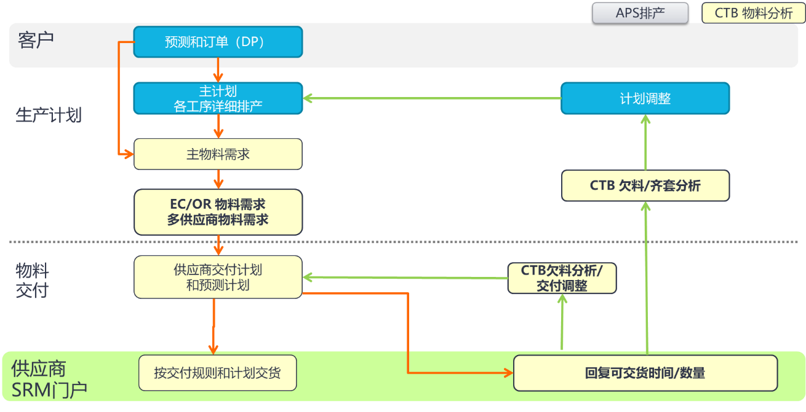  
 排产易APS系统之所以称之为系统而不是排产工具，除了必要的排产引擎以外，系统还通过单元化管理，实现多人协同拟定计划或维护数据、或与周边系统的实时协作。通过丰富的可配置的功能，可以想不同层次、不同职能的管理者推送相关关键事件和KPI，协助用户监督和推动整个计划过程的执行。协助企业提高核心竞争力！  
  
**突出优势**  
 排产易APS系统，实现一键式高速排程软件。把有规律有原则的复杂计算过程交由系统完成，从而很好地避免了由于复杂的计划过程而导致排程的误差与失误。把计划员从复杂而又重复进行的手工计算作业中释放出来，重点工作变成如何把计划管理好，提升计划管理水平。实现生产计划由对应型计划管理到改善型计划管理的质的飞跃。  
 排产易APS系统，使得计划规范化、程序化。对排程人员经验的总结与归纳，构建出相应排产方案，形成相应的行业方案。使企业既可以减少对资深员工的依赖，又能降低由于人才流动所带来的技术风险。行业排产方案是对计划员的排产经验和方法的积累，实现计划员的知识继承。  
  
**客户收益**  
 充分挖掘企业潜力，优化生产计划，提升生产效率，降低设备及人力成本，提高客户的交期达成率。  
 实现精益采购，依据生产执行采购计划，不盲目采购，缩短物料采购提前期，使物料供应配合生产，避免因欠料引起交货延期。  
 通过精益生产和精益采购最大限度降低物料库存，缩减原材料、半成品的在库数量以及在制品的现场停留时间，从而减少物料占用资金，加快库存周转，增加企业流动资金。  
 提升市场反应能力，快速响应客户需求，积极应对紧急插单，平衡客户各种订单要求，提升服务水平和客户满意度。  
 梳理业务流程，使得工厂管理标准化、透明化、可视化，精准掌控整个生产过程，为企业决策提供依据。  
 通过管理透明化，明确计划与执行的差异性，借助流程不断改进、管理不断规范和差异逐渐消除。从而不断提升企业管理水平，增强企业竞争力，提升企业形象。

## 第一章 模块构成

### 1.1 高级计划排产系统APS

**概要**

通过APS模块处理工厂内，主计划、详细日调度计划的安排。可独立使用。

**特征**

排产易APS系统可以快速速地建立多层次、多品种、多工序生产计划。它同时考虑设备和、模治具或者人员的负荷，将工厂中的每一台设备未来计划精确到以秒单位进行安排。在排产的同时，系统会自动统计出指定周期（日、周或者月）内工厂或车间级别的负荷情况，从而可以指导接单及调整产能。

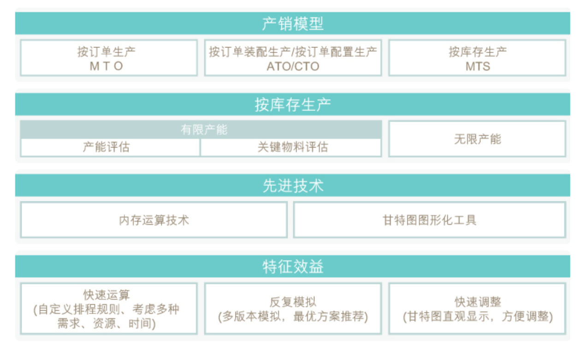

### 1.2 高级物料系统

**概要**

通过高级物料模块，处理物料交付计划、齐套欠料分析。可独立使用。

**特征**

排产易高级物料模块不仅仅考虑基本的MRP计算逻辑，生成供应商交付时间，还充分考虑上层计划的波动，提出了动态安全库存的概念，供应商交货频率/节奏，使得物料交付的时间点更加精确，库存更加合理。当物料不能满足需求时，根据材料的在库、供应商交付答复自动分析产品齐套欠料情况，释放引不齐套又被占用的物料，供其他产品使用。同时计算出各产品需求最早可齐套生产的时间。

## 第二章 系统设置

### 2.1 排产单元

排产单元是EasyAPS运行的基本单位，所有的业务操作都必须依赖于排产单元。排产单元可以理解为一个工厂，例如一个公司有A工厂和B工厂两个工厂，可以建立A工厂排产单元和B工厂排产单元。排产单元主要信息：排产单元代码、名称，所属的行业模板。在此界面可以新增、修改、删除排产单元。

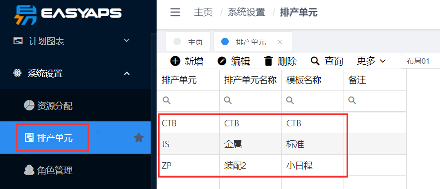

-   新建立排产单元：如图，点击新增按钮，然后输入排产单元编码、排产单元名称、选择模板，最后点击保存，排产单元新增完成。

选择模板有：

1.  CTB：物料齐套计算模型。
2.  标准：计划排产模型，有订单级和工序级排产方案。
3.  小日程：计划排产模型，有更详细的排产方案——初始化排产、均衡化排产、排产顺序记录、计划重排与调整。（标准模型一般用在多工序，小日程一般用在单工序，因为小日程里面有一些针对单工序设置好的排产方案）。

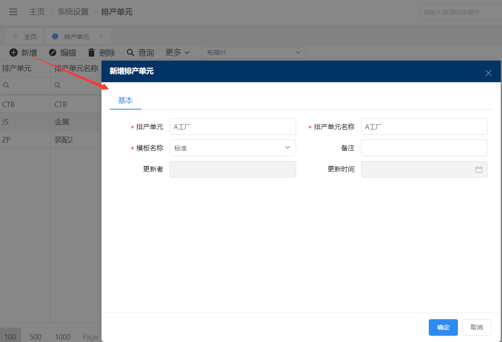

-   修改排产单元：如图，点击编辑按钮可以修改排产单元名称、增加备注，但排产单元编号和模板是不能修改的，修改后记得保存。

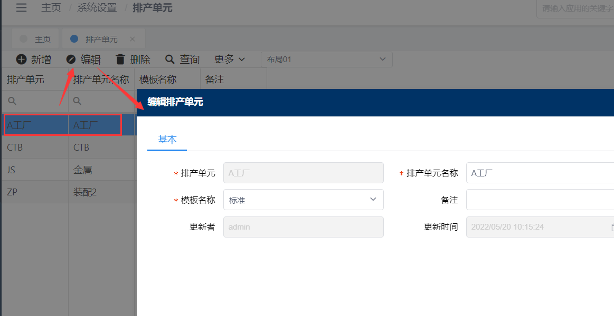

-   删除排产单元：选择要删除的排产单元，点击删除按钮确定，完成排产单元的删除。

### 2.2 角色管理

设定管理排产单元的角色，一个排产单元可以有多个。针对排产单元中的各个功能模块给角色授予权限（查看、编辑、导入）。

-   新建角色：如图，点击新增按钮，输入角色编号、角色名称，选择要新增角色的排产单元，然后勾选授予该角色的模块权限，点击保存。新增的角色在左边显示。

    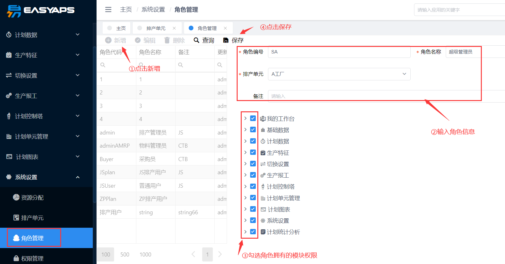

-   修改角色：如图，在左边选择要修改的角色，点击编辑按钮，可以修改角色名称或增加/删除模块权限。

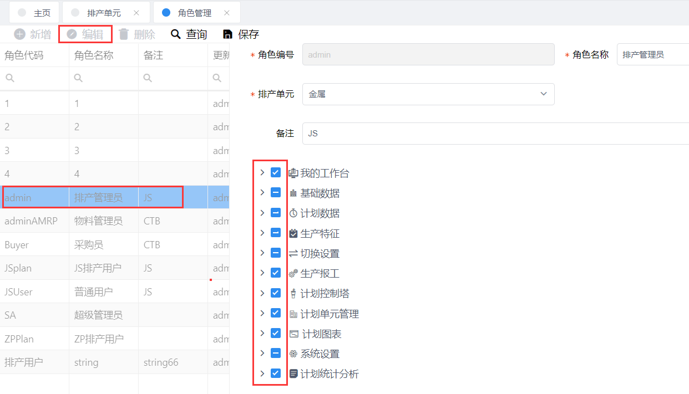

-   删除角色：如图，在左边点击要删除的角色，然后点删除按钮删除角色。

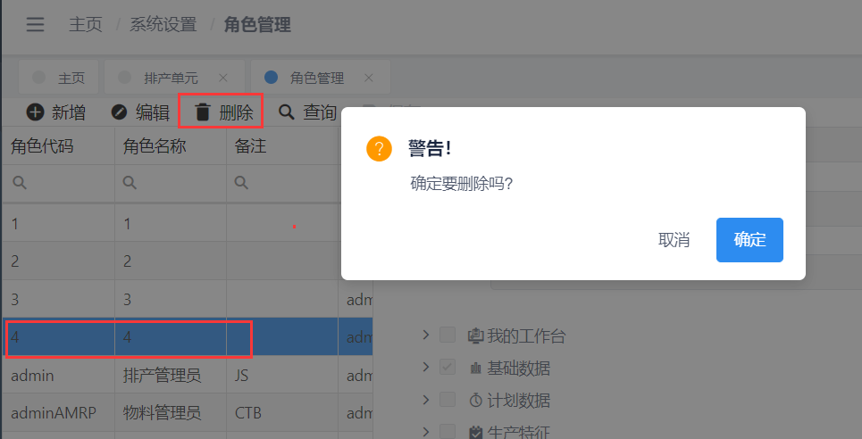

如果用户已经对该角色进行授权，则应该先在用户管理中取消对于此角色的授权，再删除该角色。

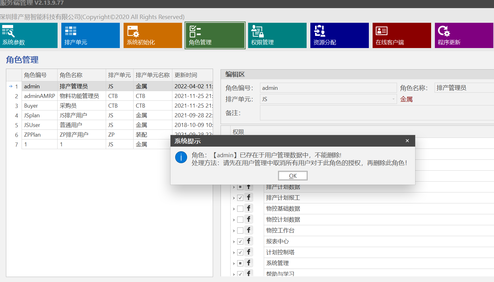

### 2.3权限管理

EasyAPS的用户权限是以角色为单位进行管理的，一个用户可以拥有多个角色，这样同一个用户可以管理多个不同的排产单元。也就是说一个角色对应一个排产单元，但一个用户可以有多个角色。在此界面设定用户编号、名称、密码等基本信息。

-   新建用户：如图，点击新增，然后输入用户编号、用户名称、用户密码，最后选择赋予用户的角色权限。保存后的用户在左边显示。

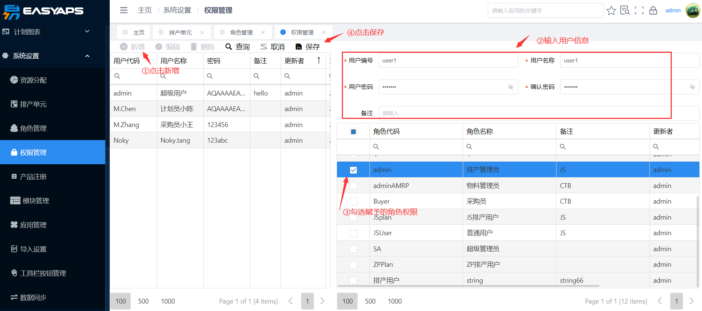

-   修改用户：如图，在左边选择要修改的用户，点击编辑按钮，可以修改用户名称、用户密码、用户所具有的角色权限。

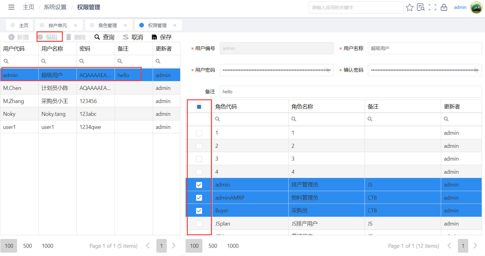

-   删除用户：如图，在左边选择要删除的用户，点击删除按钮完成删除。

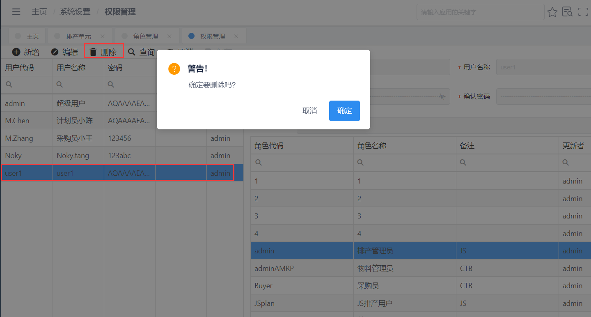

### 2.4 资源分配

资源分配可以给用户分配资源的实绩录入权限，实绩录入权限是指用户能不能输入这个资源的完工数据。如果用户没有该资源的实绩录入权限，则不能录入这个资源的报工数据。

修改资源分配：如图，选择要修改的用户，然后点击编辑按钮增加/减少用户的资源权限。

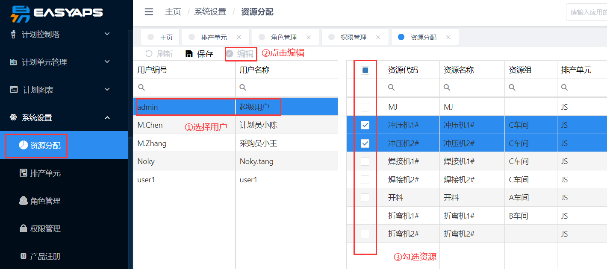

### 2.5 产品注册

在产品注册进行软件授权，授权成功后会显示公司名称、加密狗序列号和使用维护期限等信息。输入供应商提供的产品注册号码，然后点击确定，完成注册。

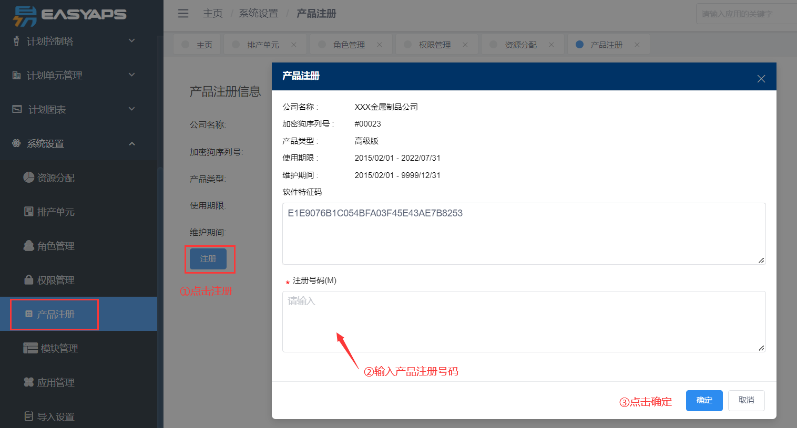

## 第三章 GUI

### 登录

如图，输入登录用户、密码、选择排产单元后点击登录。

登陆后的主界面。

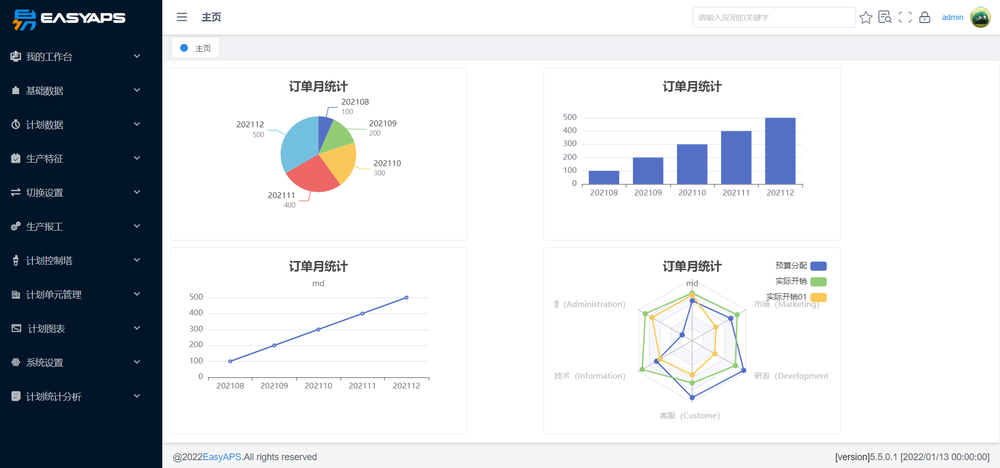

### 3.2 全局操作界面

全局操作界面介绍排产易软件的整体布局及操作

1.  菜单栏：软件的菜单放置在左边
2.  搜索框：可以在此处快速搜索要找的菜单。
3.  已打开菜单：显示已打开的菜单。
4.  表格按钮：表单常用的按钮。
5.  表单列名：表单的列名、单据的表头。

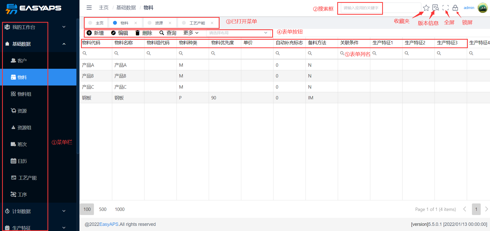

#### 3.2.1常用的表单操作按钮

**1）表格按钮操作**

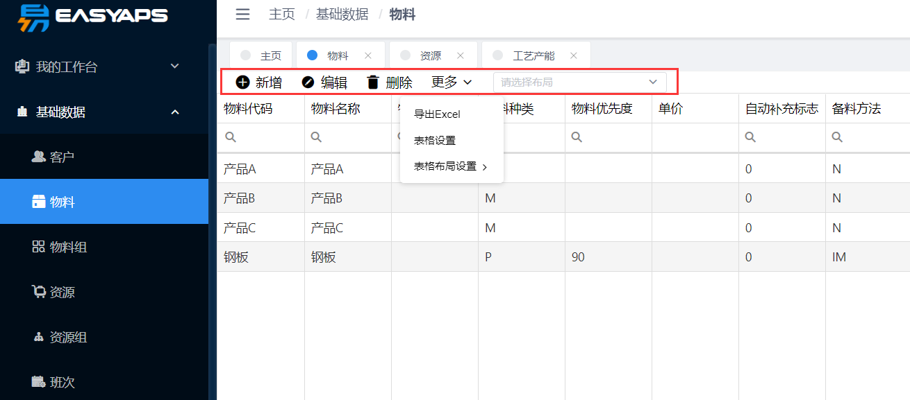

1.  新增：点击新增，可以打开新增界面，新增数据。
2.  编辑：点击编辑，可以打开编辑界面，修改数据。
3.  删除：选中需要删除的数据，点击删除，可以删除数据。
4.  更多：点击更多可以把数据导出Execl、进行表格设置、设置表格布局。
5.  请选择布局：可修改当前表单界面布局。

**2）表格列操作**

点击表头字段，可以对数据进行升序或降序排列。

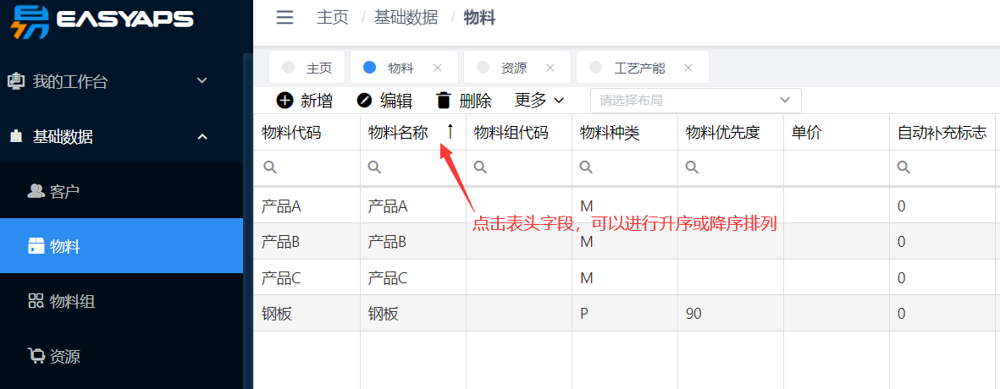

#### 3.2.3 表单界面布局编辑

系统自带缺省布局，布局中会记录行的高度、列的宽度、显示的列、筛选条件、排序等信息，每个用户可以根据需要建立多个布局，根据实际需要选择布局。

1.  添加新布局：通过更多→表格布局设置→添加新布局，打开物料表格设置，输入布局名称，勾选可见字段后点击确定，即可添加新布局。

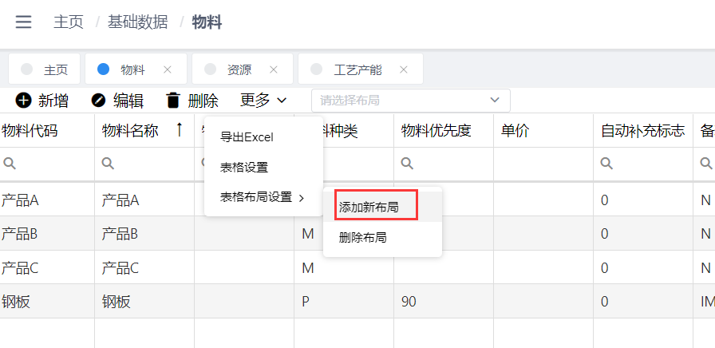

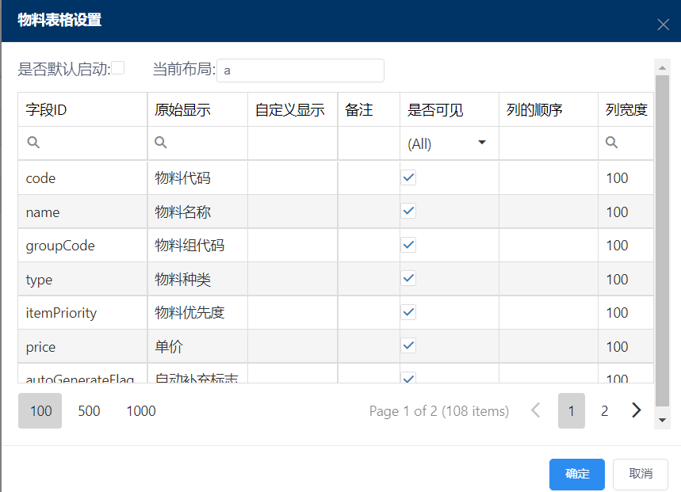

1.  设置启动布局：在物料表格设置勾选“是否默认启动”，即可设置启动布局。

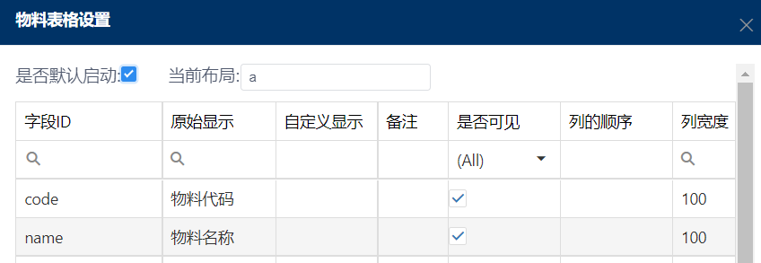

1.  修改布局：打开表格设置可以修改布局。

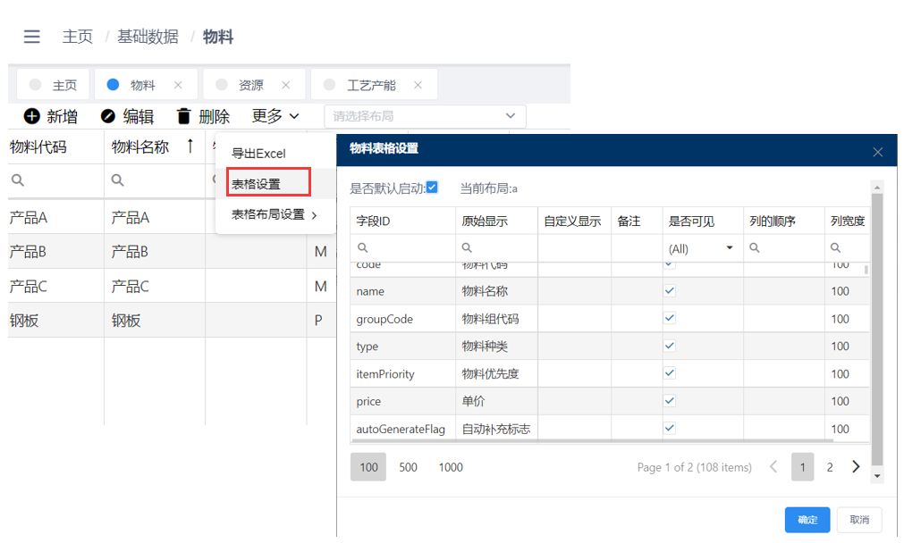

**注：**系统的缺省布局不能编辑，只有新建的布局才能任意修改。

### 3.3 排产引擎界面

如下图为排产引擎中资源甘特图的整体布局：

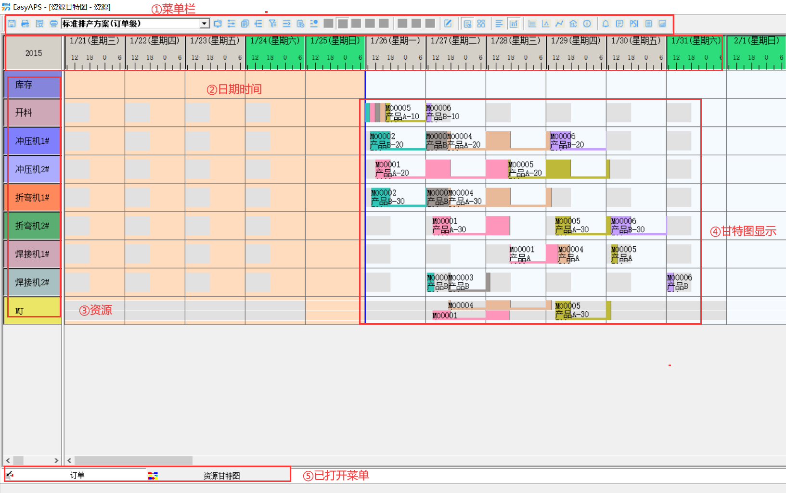

1.  菜单栏：排产引擎界面的菜单栏，可使用菜单的按钮进行排产及查看排产结果。
2.  日期时间：显示的日期及时间。
3.  资源：显示该排产单元的资源。
4.  甘特图显示：排产后的甘特图显示。
5.  已打开的菜单：在底部显示已打开的菜单。

具体菜单名称如下图：

## 第四章 数据接口

外部数据可以通过排产易标准功能从外部第三方系统通过Excel、SQL的方式导入排产易各模块。

### 4.1数据导入

#### 4.1.1导入设置

在导入设置可以设置导入数据的方案。

##### 4.1.1.1导入模板

在导入设置界面导出“导出Excel模板”作为导入模板

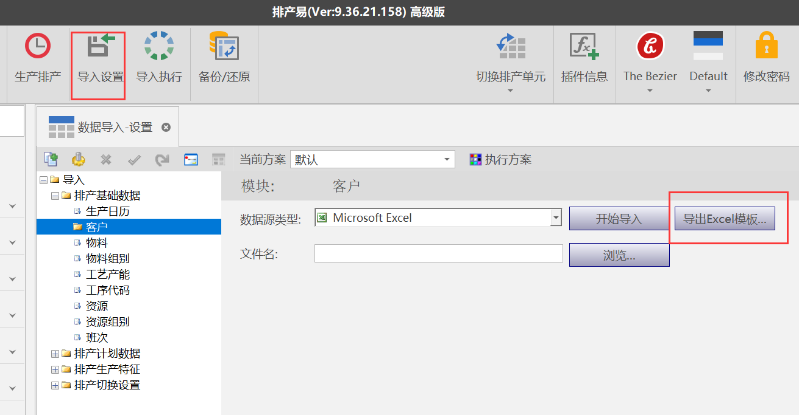

客户导入模板部分样例：

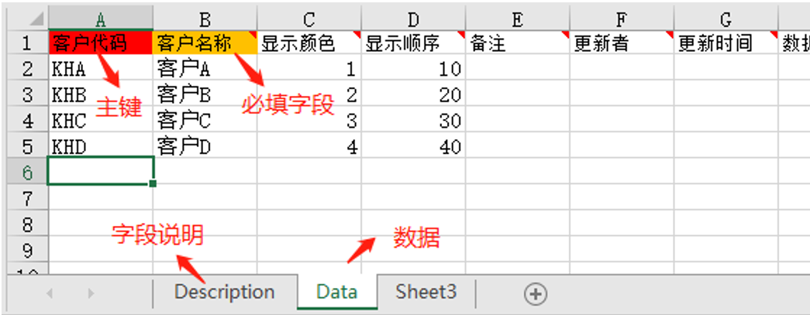

红色字段代表主键，黄色是必填字段；Description（sheet1）为excel数据字段说明（必需要有第1个sheet）,Data（sheet2）为数据。

##### 4.1.1.2编辑导入方案

主要是给业务角色定义数据导入的方案，例如PC计划员要排产，要导入物料、BOM、制造订单等数据，定义一个方案可以一次导入，提高效率。

**新增方案：**如下图新增方案命名确定。

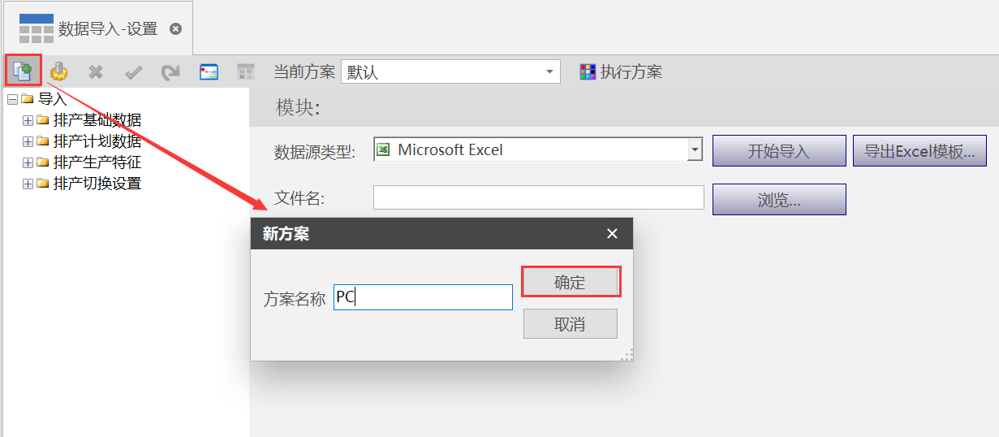

**编辑方案:**勾选需要导入的数据后保存。

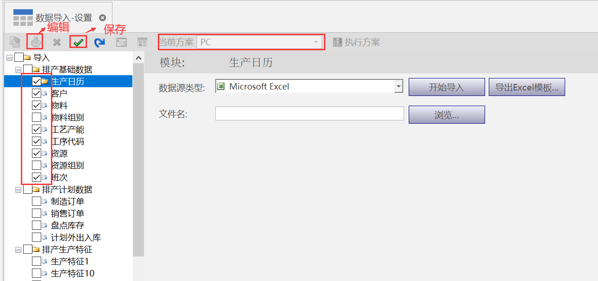

##### 4.1.1.3设置映射关系

设置导入的更新方式、数据类型、导入路径、字段映像（把导入模板的字段和APS的字段对应）注意模板表不能是打开状态。

如下图：点击编辑方案，在要设置的表右击，选择【编辑映射…】，弹出导入功能编辑，在这里设置更新方式、数据源类型、文件名（即导入模板所在路径）以及字段映射，字段映射要一一对应。设置完毕后确定，保存方案。

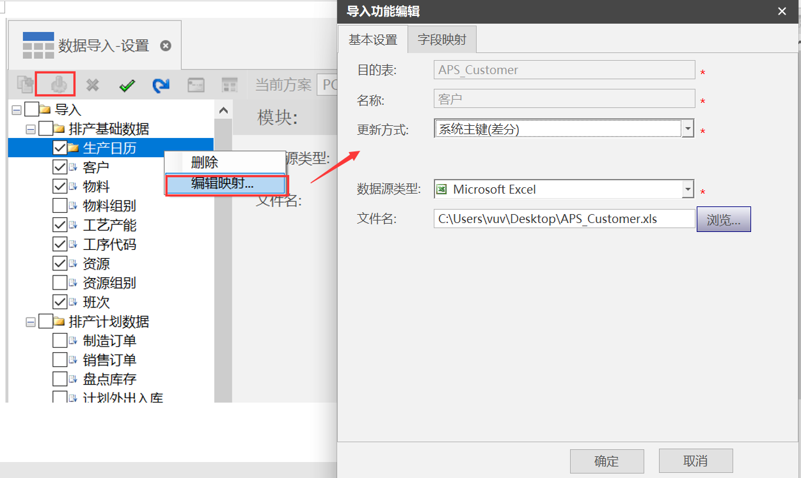

系统有3种更新方式

1.  系统主键（差分）：与系统表数据进行对比，对已有的数据进行更新，没有的数据则插入。

例：APS_Customer表（系统主键：客户代码）

客户表原数据：

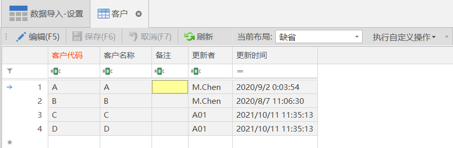

导入模板表数据：

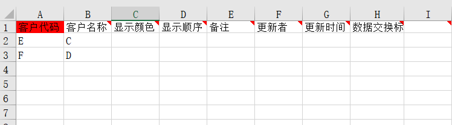

更新结果：

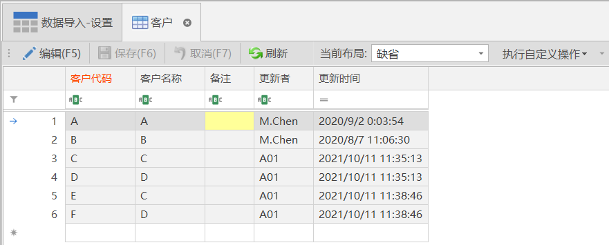

1.  全删全写（替换）：把原表的数据全删除，导入新的数据 。

例：APS_Customer表（系统主键：客户代码）

客户表原数据：

导入模板表数据：

更新结果：

1.  自定义主键更新（替换）：以自定义主键与原表数据进行对比，对已有的数据进行更新，没有的数据则插入。

例：APS_Customer表（自定义主键：客户名称）

客户表原数据：

导入模板表数据：

更新结果：

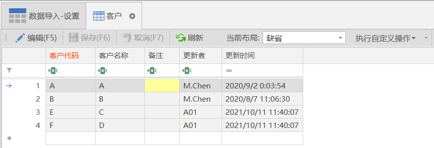

#### 4.1.2 导入执行

设置好导入的方案，业务人员在排产前选择对应的方案可以导入数据。

导入数据可选择方案后点击【执行方案】批量导入；也可以选择要导入的数据单向导入，点击【开始导入】，一次只导入一种数据。

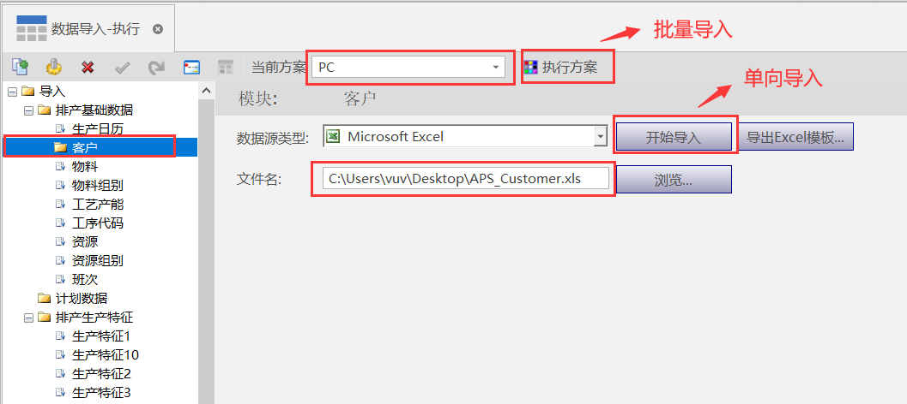

如果导入报错，请查看报错提醒解决报错问题后再导入，直至导入成功。

### 4.2数据接口扩展存储过程说明

通过扩展存储过程的功能对接口数据进行处理前、处理中、处理后的数据加工，帮助用户完成对数据的处理,每个存储过程处理结果后必须要有返回值。每一个单项导入动作都会执行以下三个存储过程，如果导入方案中有多项导入模块，则会多次执行以下三个存储过程。

1.  处理前存储过程（pro_OnDealDataBaseDataBefore，外部数据更新到正式表之前）

参数：

@PlanUnitCode：排产单元

@UserId：登录用户名

@ActionFlag：“Input_”+前端导入模块名称

返回值：

成功：SELECT 'OK' AS sStatus

失败：SELECT 'NG' AS sStatus,'执行251数据出错' AS sMessage

1.  处理中存储过程（pro_OnDealDataBaseDataCommit，外部数据更新到正式表后，事务提交前）

参数：

@PlanUnitCode：排产单元

@UserId：登录用户名

@ActionFlag：“Input_”+前端导入模块名称

@tmpTable：系统生成的临时表

返回值：

成功：SELECT 'OK' AS sStatus

失败：SELECT 'NG' AS sStatus,'执行251数据出错' AS sMessage

1.  处理后存储过程（pro_OnDealDataBaseDataAfter，外部数据更新到正式表后，事务提后）

参数：

@PlanUnitCode：排产单元

@UserId：登录用户名

@ActionFlag：“Input_”+前端导入模块名称

返回值：

成功：SELECT 'OK' AS sStatus

失败：SELECT 'NG' AS sStatus,'执行251数据出错' AS sMessage

### 4.3排产引擎备份

系统有排产引擎参数备份功能，在系统管理-排产方案设置中勾选是否弹出保存备份询问对话框。

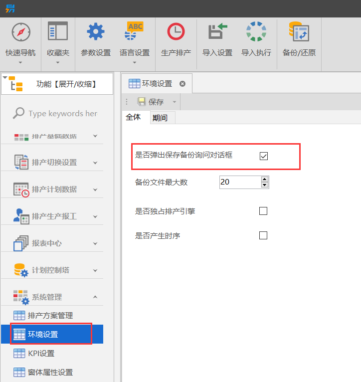

在排产引擎关闭时就会弹出对话框选择保存备份。

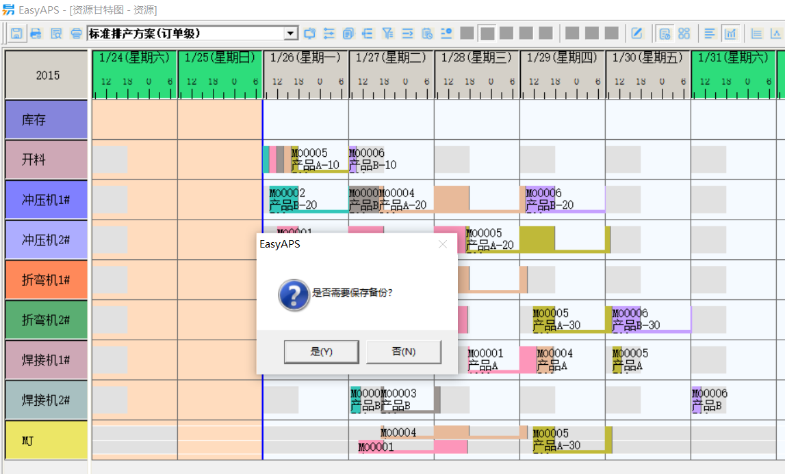

备份恢复

在备份/还原选择对应的备份，点击确定。

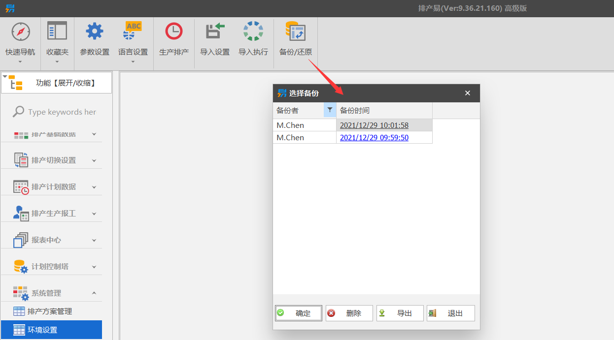

## 第五章 排产数据管理

### 5.1 工作区

#### 5.1.1 我的门户

我的门户主要显示任务提醒信息及KPI图表的查看。（设置方法请查看：[任务提醒设置](#595-任务提醒设置)、[KPI设置](#593-kpi设置)），方便计划员快速了解当前计划的进度。

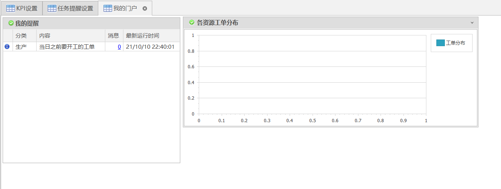

#### 5.1.2 我的工作

在我的工作可以打开排产引擎、导入数据设置和执行以及还原备份数据。

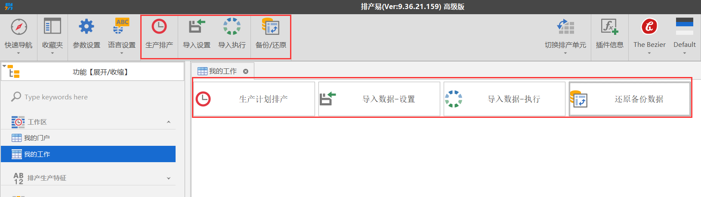

点击生产排产加载时，系统会调用存储过程pro_OnCallEngineBefore。

### 5.2排产生产特征

#### 5.2.1生产特征1\~10

生产特征是排产易里面中一类特殊的属性类别，这些生产特性会被引用于物料表、制造订单、以及切换设置表。排产时系统会自动的根据这些生产特征匹配符合资源，或者计算相应的切换时间。

### 5.3 排产基础数据

#### 5.3.1 客户

在客户表可以设定客户的信息，客户代码不能重复。客户信息可以在制造订单或销售订单使用，用于记录是哪个客户的订单。

#### 5.3.2 物料

在物料表可以录入物料的基础信息，物料可以是成品、原料、也可以是半成品，在工艺产能、制造订单、盘点库存、计划外出入库都可以用到物料信息。

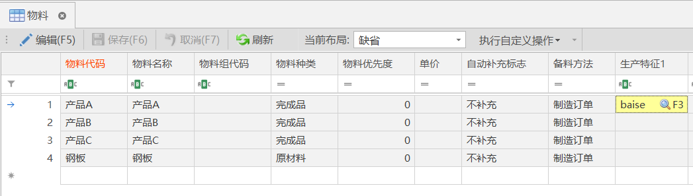

物料表字段含义：

| 字段名称               | 字段说明                                                                                                                                                                                                                                                                              | 使用说明                                                                       |
|------------------------|---------------------------------------------------------------------------------------------------------------------------------------------------------------------------------------------------------------------------------------------------------------------------------------|--------------------------------------------------------------------------------|
| 物料代码               | 物料的编码，具有唯一性                                                                                                                                                                                                                                                                |                                                                                |
| 物料名称               | 物料的名称                                                                                                                                                                                                                                                                            |                                                                                |
| 物料组代码             | 物料所属的物料组代码                                                                                                                                                                                                                                                                  |                                                                                |
| 物料种类               | 物料的分类。M：原材料；H：半成品；I：中间品；P：完成品                                                                                                                                                                                                                                |                                                                                |
| 物料优先度             | 设定分派时的优先度。分派规则中设定物料优先度时将会被引用                                                                                                                                                                                                                              |                                                                                |
| 单价                   | 单位数量的价格。不影响排程。                                                                                                                                                                                                                                                          |                                                                                |
| 自动补充标志           | 当销售订单的物料有自动补充标志时，会与制造订单、库存信息进行关联                                                                                                                                                                                                                      | [例1自动补充标志](#例1-自动补充标志)                                           |
| 备料方法               | 物料不足的备料方法;自动补充的情况下生成制造订单。                                                                                                                                                                                                                                     |                                                                                |
| 生产特征1              | 物料的特征，排产时将会被参考                                                                                                                                                                                                                                                          | [例2生产特征、数值特征](#例2-生产特征数值特征)                                 |
| 数值特征1              | 物料的数值特征，排产时特征将会被参考                                                                                                                                                                                                                                                  |                                                                                |
| 制造效率               | 物料的制造效率。1表示100%，如果是0的情况下默认为1.                                                                                                                                                                                                                                    |                                                                                |
| 显示颜色               | 设置在图表中物料的显示颜色，在甘特图显示——棒显示颜色运用                                                                                                                                                                                                                              |                                                                                |
| 显示顺序               | 设定库存图表等的表示顺序                                                                                                                                                                                                                                                              |                                                                                |
| BASE物料代码           | 指定订单展开时使用的物料工艺产能。如果在订单/物料设定了BASE物料代码，则使用BASE物料代码展开订单，最终工序输出订单物料。                                                                                                                                                               | [例3BASE物料代码](#例3-base物料代码)                                           |
| 物料切换对象           | 进行原料切换时，指定切换后新的物料                                                                                                                                                                                                                                                    | [例4原料切换](#例4-原料切换)                                                   |
| 物料切换方法           |  设置进行原料切换的方法。                                                                                                                                                                                                                                                             |                                                                                |
| 库存MIN                | 安全库存数量的最小值。如果有自动补充标志的情况，超过该值时将会自动补充订单                                                                                                                                                                                                            |  [例5库存MIN、目标库存MIN](#例5-库存min目标库存min)                            |
| 目标库存MIN            | 一般与库存MIN相同，按照积极消费安全库存的形式进行排程。库存MIN和目标库存MIN也可并用。例如：目标库存MIN=100，库存MIN=50的情况下，按照数量不下降到50以下，且最终以数量100来设定计划。                                                                                                   |                                                                                |
| 库存MAX                | 物料的最大库存，即库存上限                                                                                                                                                                                                                                                            |                                                                                |
| 物料制约标志           | 排产方案参数中设定[原料制约]的情况下，且物料制约为是时，对于输入指令数量不足的工作和其之后的工序中将分派在虚拟资源。                                                                                                                                                                  | [例6物料制约标志](#例6-物料制约标志)                                           |
| 库存增减方法           | 设定库存数量的增减方法，在排产引擎库存图表中可反映曲线的设定。 II 梯形/梯形：库存增减方法以制造为梯形，消费为梯形。  IL 梯形/线形：库存增减方法以制造为梯形，消费为线形。  LI 线形/梯形：库存增减方法以制造为线形，消费为梯形。  LL 线形/线形：库存增减方法以制造为线形，消费为线形。 |                                                                                |
| 制造批量MAX            | 决定自动补充订单的大小时使用。                                                                                                                                                                                                                                                        | [例7制造批量MAX、MIN、单位](#例7-制造批量maxmin单位)                           |
| 制造批量MIN            | 决定自动补充订单的大小时使用。                                                                                                                                                                                                                                                        |                                                                                |
| 制造批量单位           | 决定自动补充订单的大小时使用。                                                                                                                                                                                                                                                        |                                                                                |
| 制造批量大小计算方法   | 决定自动补充订单的大小时使用。                                                                                                                                                                                                                                                        |                                                                                |
| 制造批量尾数为末尾     | 否：将包含计算剩余量的工作先关联； 是：将包含计算剩余量的工作最后关联                                                                                                                                                                                                                 | [例8制造批量尾数为末尾](#_例8_制造批量尾数为末尾)                              |
| 工作分割数量           | 设定工作分派数量，与工作的制造数量无关。例如分割数量为2，则工作被分割成2个工作                                                                                                                                                                                                        | [例9工作分割](#_例8_工作分割)                                                  |
| 工作分割比率           | 设定工作分割比率。按照工作的制造数量和分派比率进行分割后工作的分派。                                                                                                                                                                                                                  |                                                                                |
| 工作并行数量           | 设定分派的工作是否由若干资源进行并行作业。                                                                                                                                                                                                                                            |                                                                                |
| 工作批量MIN            | 数量小于该值的时候，调整数量让工作大于或等于该值。                                                                                                                                                                                                                                    | 用法同制造批量，但工作批量除了根据订单数量进行分派，还可以根据制造批量进行分派 |
| 工作批量MAX            | 数量超过该值的情况下进行分派工作。                                                                                                                                                                                                                                                    |                                                                                |
| 工作批量单位           | 分派工作的数量为该值的倍数。                                                                                                                                                                                                                                                          |                                                                                |
| 自定义字符             | 当已有字段不满足使用时，可以自定义字段                                                                                                                                                                                                                                                |                                                                                |
| 关联条件               | 指定同一物料中的关联条件。没有指定的情况下无条件进行关联。                                                                                                                                                                                                                            | [例10关联条件](#例10-关联条件)                                                 |
| 工作输入指令排序表达式 | 工作进行关联时的排序方法                                                                                                                                                                                                                                                              |                                                                                |
| 工作输出指令排序表达式 | 工作进行关联时的排序方法                                                                                                                                                                                                                                                              |                                                                                |

#### 5.3.3 物料组别

物料组别可以维护物料的组别信息。录入物料组别的信息，然后在物料表的物料组代码字段选择这里的组别信息，可以对物料进行分组。

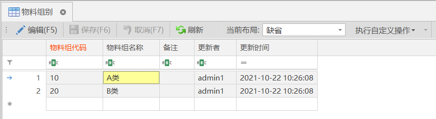

#### 5.3.4 资源

资源表主要维护生产用到的资源资源信息，包括机器设备、作业员、辅助工具等资源。在工艺产能表会用到该表的资源信息。

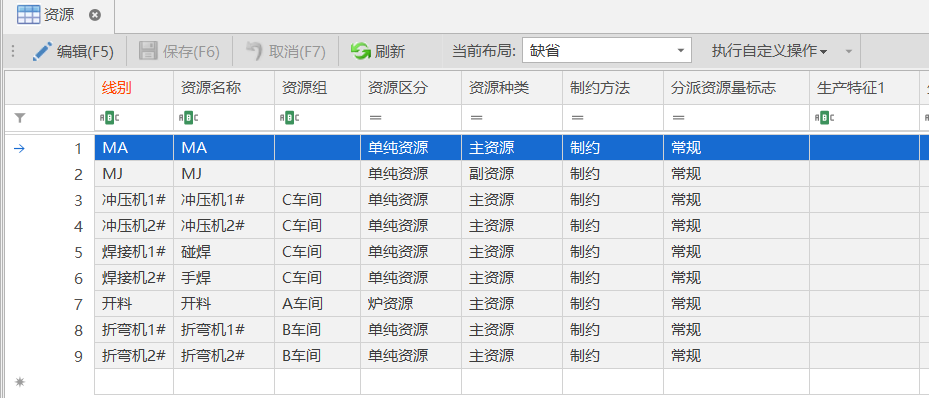

资源表字段含义：

| 字段名称                    | 字段说明                                                                                                                                                                                                                                                                                                                                                         | 使用说明                                                        |
|-----------------------------|------------------------------------------------------------------------------------------------------------------------------------------------------------------------------------------------------------------------------------------------------------------------------------------------------------------------------------------------------------------|-----------------------------------------------------------------|
| 资源代码                    | 资源的编码，具有唯一性                                                                                                                                                                                                                                                                                                                                           |                                                                 |
| 资源名称                    | 资源的名称                                                                                                                                                                                                                                                                                                                                                       |                                                                 |
| 资源组                      | 资源所属的资源组                                                                                                                                                                                                                                                                                                                                                 |                                                                 |
| 资源区分                    | S 单纯资源 F 炉资源：为分派同时开始、同时结束的多个工作的资源                                                                                                                                                                                                                                                                                                    | [例11炉资源](#例11-炉资源)                                      |
| 资源种类                    | M 主资源：生产的主要资源。 S 副资源：协助主资源的资源。 D 虚拟资源：订单根据工艺产能数据没有可分派资源，则分派在虚拟资源上。 G 外协资源：资源的种类为外协资源 I 库存资源：分派库存订单的资源                                                                                                                                                                     |                                                                 |
| 制约方法                    | R 制约：制约资源量 N 不制约：不制约资源量 V 按资源量分派：按资源量分派进行制约资源                                                                                                                                                                                                                                                                               | [例12资源量制约](#例12资源量制约)                               |
| 分派资源量标志              | 设定资源量的分派数量。 0 常规：分派资源量为使用指令的必要资源量。 1 与制造数量成比例：按照制造数量和必要资源量的比例进行分派资源量                                                                                                                                                                                                                               | [例13分派资源量标志](#例13分派资源量标志)                       |
| 生产特征1                   | 资源的生产特征1                                                                                                                                                                                                                                                                                                                                                  | [例2生产特征、数值特征](#例2-生产特征数值特征)                  |
| 数值特征1MIN                | 能够制造的数值特征1的最小值                                                                                                                                                                                                                                                                                                                                      |                                                                 |
| 数值特征MAX                 | 能够制造的数值特征2的最大值                                                                                                                                                                                                                                                                                                                                      |                                                                 |
| 显示顺序                    | 在资源甘特图、资源负荷图表的显示顺序                                                                                                                                                                                                                                                                                                                             |                                                                 |
| 显示颜色                    | 在资源甘特图、资源负荷图表的显示颜色                                                                                                                                                                                                                                                                                                                             |                                                                 |
| 瓶颈资源                    | 设定是否为瓶颈资源。排产方案参数的[工作临时固定]中使用[瓶颈资源]时该值变为[锁定资源]时分派工作进行临时固定。  0 常规：该资源不是瓶颈资源。 1 瓶颈资源：该资源为瓶颈资源。                                                                                                                                                                                        | [例14工作临时固定](#例14工作临时固定)                           |
| 无效资源                    | 设定该资源能否解除分派。 0 常规：该资源为分派对象。 1 无效：该资源不为分派对象                                                                                                                                                                                                                                                                                   |                                                                 |
| 制造中断时间MAX             | 设定工作中如休息等可中断的时间。设定0的情况下可以允许任意长度中断时间。设定-1的情况下表示不允许任何中断。                                                                                                                                                                                                                                                        | [例15中断时间](#例15中断时间)                                   |
| 前设置中断时间MAX           | 设定前设置期间中休息等的中断时间。设定为0的情况下可允许设定任意长的中断。设定负数的情况下不允许任何中断。并且，负数的情况下前设置任务和制造任务的分派不可分开。                                                                                                                                                                                                  |                                                                 |
| 后设置中断时间MAX           | 设置由于休息等原因可以中断工作的最长时间。设置0就允许任何长度的时间。设置负数绝对不允许中断。并且，负数的情况下后设置任务和制造任务的分派不可分开。                                                                                                                                                                                                              |                                                                 |
| 前设置和制造之间中断时间MAX | 设定前设置和制造任务之间所允许相离时间长度，设置0或负值表示不能中断                                                                                                                                                                                                                                                                                              |                                                                 |
| 后设置和制造之间中断时间MAX | 设定后设置和制造任务之间所允许相离时间长度，设置0或负值表示不能中断。                                                                                                                                                                                                                                                                                            |                                                                 |
| 制造效率                    | 设定资源的制造效率。1表示100％。0的情况下默认为1。                                                                                                                                                                                                                                                                                                               |                                                                 |
| 前设置时间效率              | 设定前设置花费时间的系数。1表示100％。设定0值当作1处理                                                                                                                                                                                                                                                                                                           |                                                                 |
| 后资源                      | 在某资源上进行工作时，限制其后面的工序进行的资源被称作后资源制约。                                                                                                                                                                                                                                                                                               | [例16后资源制约](#例16后资源制约)                               |
| 严格遵守后资源制约          | Yes 是：在后资源里设定的资源代码筛选候补资源 No 否：后资源里设定的资源只作为候补资源的部分成员，所以也可能分派在非后资源上                                                                                                                                                                                                                                       |                                                                 |
| 实绩输入标志                | M 必须：没有实绩的工作在计划开始以后会进行分派 N 非必项：指示完毕工作已过去，并且没有其它信息的情况下，视为遵守计划，即该工作已经完成                                                                                                                                                                                                                            | [例17实绩输入标志](#例17实绩输入标志)                           |
| 分割有效条件式              | 记录临时分派时的分割条件。多少小时以上中断进行分割，等等的指定。仅对主资源有效。                                                                                                                                                                                                                                                                                 | [例9工作分割](#_例9_工作分割)                                   |
| 制造任务贴近下一个任务      | 设定是否让制造任务贴近下一个分派任务。 Yes 是：后面的分派任务尽可能接近制造任务 No 否：后面的分派任务不接近制造任务                                                                                                                                                                                                                                              |                                                                 |
| 制造任务可开工日期          | 制造任务可以开始生产的日期。例：2021/10/10-2021/10/20。                                                                                                                                                                                                                                                                                                          | [例18制造任务可开工日期、时间段](#例18制造任务可开工日期时间段) |
| 制造任务可开工时间段        | 制造任务可以开始生产的时间段，可以采用与生产日历表的出勤模式的记述相同方法。例：8:00-12:00;14:00-18:00。                                                                                                                                                                                                                                                         |                                                                 |
| 炉有效条件                  | 设定可以使用炉资源进行加工的条件表达式。                                                                                                                                                                                                                                                                                                                         | [例11炉资源](#例11-炉资源)                                      |
| 分派有效条件                | 筛选可以分派在该资源的工作的条件表达式                                                                                                                                                                                                                                                                                                                           |                                                                 |
| 按资源量分派的任务          | 按资源量分派时候，要按资源量分派任务的任务模板(1:前设置，2:制造，3:后设置)。如果没有指定，就默认处理制造任务。                                                                                                                                                                                                                                                   |                                                                 |
| 跨其它工作分派              | No 否：在任务中断的期间内，不能分派其它工作的任务 Yes 是：在任务中断的期间内，可以分派其它工作的任务                                                                                                                                                                                                                                                             | 例19跨其它工作分派                                              |
| 保证工作的最后分派顺序      |  设定当分派事件对象时候是否保证制造订单工作的最后分派顺序，以及是否保证前后依赖设置时间。 No 否：进行工作的位置交换 Yes 是：不进行工作的位置交换。会重新计算设置时间。插入事件订单时会计算事件订单与制造订单的设置时间S 是（保证设置时间）：不进行工作的位置交换。此外不会改变上次分派时的前后设置时间。这样即使插入事件订单，前后工作间的设置时间也会得到保证。 |                                                                 |
| 资源制造批量MIN             | 设定工作的主产物输出数量的最小值。                                                                                                                                                                                                                                                                                                                               | [例9工作分割](#_例9_工作分割)                                   |
| 资源制造批量MAX             | 设定工作的主产物输出数量的最大值。工作的主产物输出数超过该值的情况下进行工作分割。                                                                                                                                                                                                                                                                               |                                                                 |
| 资源制造单位                | 订单工作或分割而生成工作的制造数量会成为该资源制造单位的整数倍。                                                                                                                                                                                                                                                                                                 |                                                                 |
| 分割工作中断时间MAX         | 分派到同一资源上同一订单的同一工序的分割工作间的中断时间设定。设置0或负值表示不能中断。                                                                                                                                                                                                                                                                          |                                                                 |
| 资源锁定禁止相同资源        | 否：当设定了依赖于父工作的资源锁定的时候，设定对于关联在同一个父工作付的多个工作允许分派在相同资源上。当在主数据中设定时，无视资源类的该设定。  是：当设定了依赖于父工作的资源锁定的时候，设定对于关联在同一个父工作付的多个工作不允许分派在相同资源上。当在主数据中设定时，无视资源类的该设定。                                                                 | 预留字段                                                        |
| 技能1                       | 技能1的值。可以应用于使用指令模板的资源有效条件表达式。                                                                                                                                                                                                                                                                                                          |                                                                 |

#### 5.3.5资源组别

资源组别主要维护资源信息。录入资源组信息，可以用于资源表对资源进行分组，更便于资源的管理。

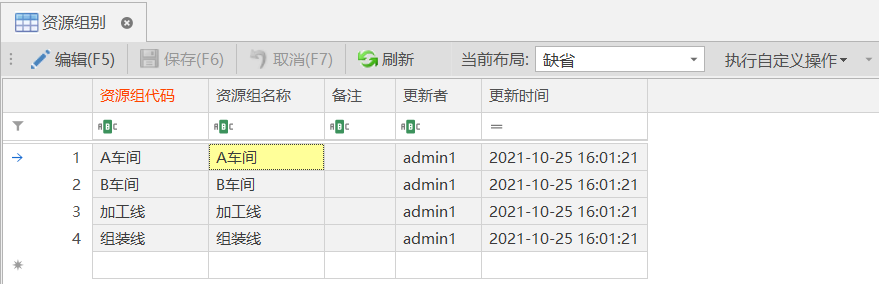

#### 5.3.6班次

班次表主要维护车间生产班次和班次的时间，这里的时间是指一天可用的生产时间，如下图，T2班次可用的生产时间为12小时。

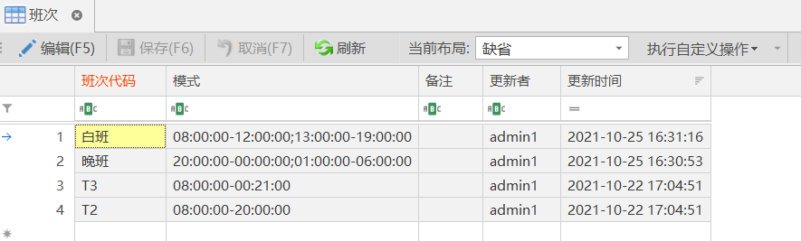

设定工作时间段。将时间与时间用-（横线）连接起来后即成为工作时间段。设定多个工作时间段时用分号将时间隔开。

[模式的设定与解释]

| 模式                               | 解释                                                                           |
|------------------------------------|--------------------------------------------------------------------------------|
| 8:00-12:00；13:00-19:00            | 8:00到12:00，13:00到19:00为可以安排工作的时间                                  |
| 8:00-10:00;10:15-12:15;13:00-17:00 | 从10:00开始休息了15分,从12:15开始休息了45分,用分号隔开可以设定多个休息时间段。 |

#### 5.3.7 日历设置

日历设置用于设定资源的班次，指定资源在哪天什么时间可以运作。

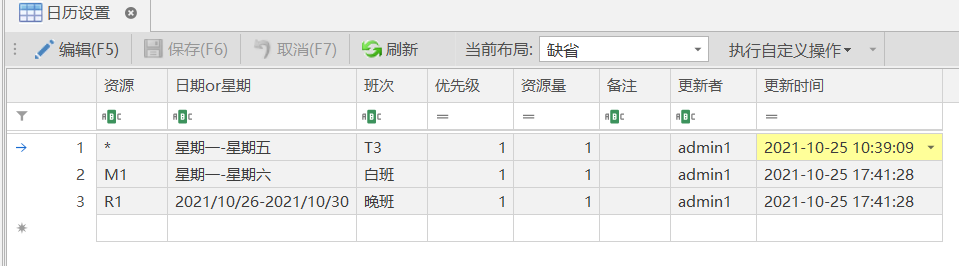

日历设置字段说明：

| 字段名称  | 字段说明                                                                                                                                           |
|-----------|----------------------------------------------------------------------------------------------------------------------------------------------------|
| 资源      | 生产日历设定的对象（资源）。如上面日历设定中资源设定了\*(星号)的情况时表示全部的资源代码。                                                         |
| 日期/星期 | 用于设定生产日历中设定对象的日期。不仅可以直接设定日期，也可以设定星期。用横线连接表示设定的范围。星期一和星期五用横线连接，表示从星期一到星期五。 |
| 班次      | 设定适用于资源和日期/星期的班次                                                                                                                    |
| 优先级    | 用于设定日历的顺序。优先级大的被优先采用。                                                                                                         |
| 资源量    | 日历中也可进行资源量的设定。设定了日历的资源量后，将适用其日历中设定的的资源量。                                                                   |

[日期/星期的设定与含义]

| **日期/星期**       | **解释**                                 |
|---------------------|------------------------------------------|
| 星期一              | 星期一                                   |
| 星期一-星期五       | 星期一到星期五。用横线连接起来表示范围。 |
| 2021/10/1           | 2021/10/1                                |
| 2021/10/1-2021/11/1 | 日期用横线连接起来也可以表示范围。       |

［日历设定例１］

| **资源** | **日期/星期** | **优先级** | **班次代码** |
|----------|---------------|------------|--------------|
| \*       | 星期一-星期五 | 1          | 白班         |
| \*       | 2021/11/1     | 10         | 休息         |

日历设定例１中，2021/11/1（星期一）和上面的星期一-星期五发生重复，优先级大的优先采用，则2021/11/1为“休息”。

［日历设定例2］

| **资源** | **日期/星期** | **优先级** | **班次代码** |
|----------|---------------|------------|--------------|
| \*       | 星期一-星期五 | 10         | 白班         |
| \*       | 2021/11/1     | 1          | 休息         |

日历设定例2中，2021/11/1（星期一）和上面的星期一-星期五发生重复、取优先级大的优先采用后则2021/11/1为白班。

[资源量设定例]

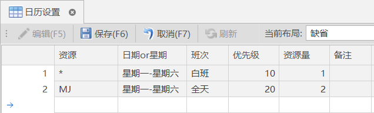

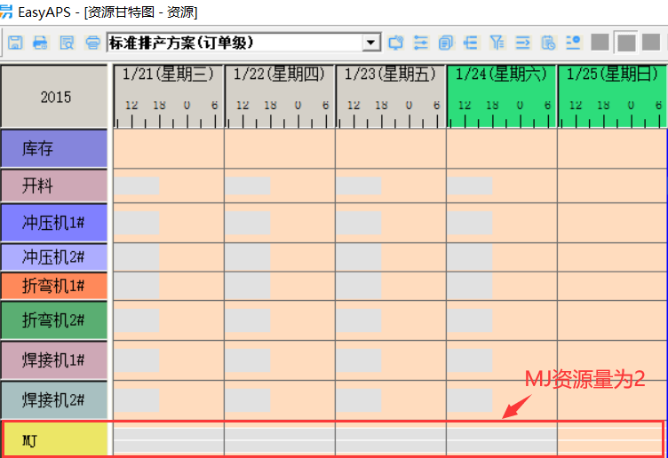

如上图，MJ资源量设置为2，其它资源设置1，则在资源甘特图可以看到MJ资源量显示为2，其它资源显示为1，也就是说MJ的能力翻倍。

#### 5.3.8 工序

工序表用于设定生产的工序信息，工序代码可以是可以是中文、数字、英文字母，也可以是英文加数字等。工序代码会被工艺产能表引用，且会在工艺产能表显示，所以建议工序代码采用中文，便于查看。

#### 5.3.9工艺产能

工艺产能维护物料的制造工艺过程（工艺路线）的信息，是系统最核心的数据表。工艺路线描述生产产品的所需工序顺序， 对于每道工序还定义了所需的资源、物料和执行工序所需时间等。 您可以使用相同工艺路线生产多个产品，也可以为每个产品定义不同的工艺路线。 同一个产品甚至可以有多个工艺路线。排产时会使用工艺产能的信息进行计算。

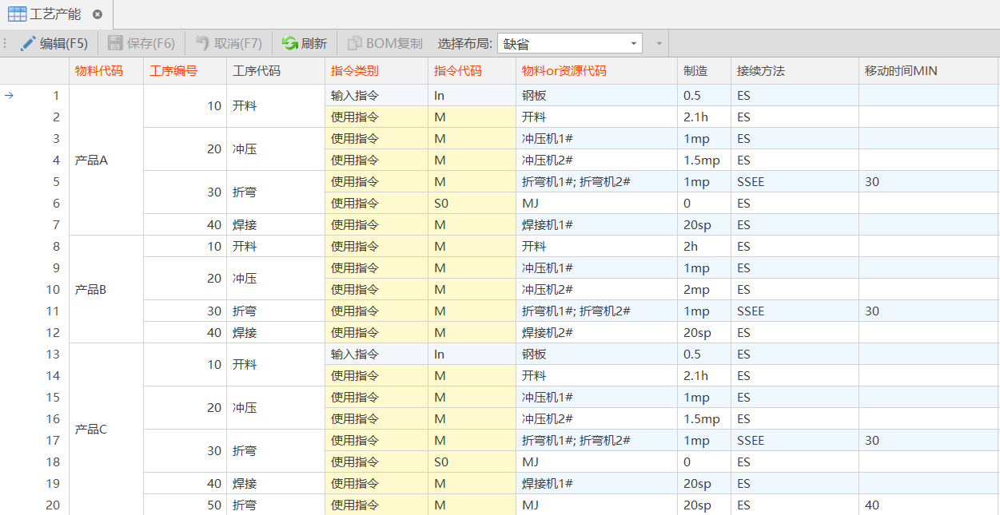

工艺产能字段含义：

| 字段名称                     | 字段说明                                                                                                                                | 使用说明                                                                                                                                                                                                  |
|------------------------------|-----------------------------------------------------------------------------------------------------------------------------------------|-----------------------------------------------------------------------------------------------------------------------------------------------------------------------------------------------------------|
| 物料代码                     | 要设置工艺产能的物料代码                                                                                                                |                                                                                                                                                                                                           |
| 工序编号                     | 可以输入任意编号，数据类型为整数；从最初的工序到最后的工序，数字由小到大进行设定。                                                      |                                                                                                                                                                                                           |
| 工序代码                     | 工序编号所对应的生产工序的代码                                                                                                          |                                                                                                                                                                                                           |
| 指令类别                     | 指令的类型，有输入指令和使用指令                                                                                                        | [例20指令类别](#例20指令类别)                                                                                                                                                                             |
| 指令代码                     | 输入指令代码：In、S 使用代码代码：M                                                                                                     |                                                                                                                                                                                                           |
| 物料or资源代码               | 对指令类别的设定，使用指令中设定资源代码，输入指令中设定物料代码                                                                        | 资源是用于制造该品目时必要的设备、作业员、模具、夹具等。使用指令的物料/资源字段是用于设定此工序中使用的资源。因此，制造某种品目时要用到多个资源组合、或有多个投入生产的资源等情况时需要设定多个使用指令。 |
| 前设置                       | 在使用指令行：设定前设置时间表达式。例：[10mp][20h][30](没有单位默认为m)。在输入/输出指令行：设定数量的输入和输出的比率。               | [例2制造、移动时间](#例24制造移动时间)                                                                                                                                                                    |
| 制造                         | 在使用指令行：设定制造时间表达式。例：[10mp][20h][30](没有单位默认为m)。 在输入/输出指令行：设定数量的输入和输出的比率。                |                                                                                                                                                                                                           |
| 后设置                       | 在使用指令行：设定后设置时间。例：[10mp][20h][30](没有单位默认为m)。 在输入/输出指令行：设定数量的输入和输出的比率。                    |                                                                                                                                                                                                           |
| 先行工序编号                 | 前一道工序的编号，用来表示前工序和当前工序的连接                                                                                        |                                                                                                                                                                                                           |
| 接续方法                     | 设定工序与工序之间的时间制约关系。有ES、EES、ESE、ESSSEE、SS、SSEE、SSEEE                                                               | [例25接续方法](#例25接续方法)                                                                                                                                                                             |
| 移动时间MIN                  | 设定工序间的时间制约最小值                                                                                                              | [例24制造、移动时间](#例24制造移动时间)                                                                                                                                                                   |
| 移动时间MAX                  | 设定工序间的时间制约最大值，仅在启用移动时间MAX的情况有效                                                                               |                                                                                                                                                                                                           |
| 报废数                       | 设定输入指令以及输出指令的废品数量                                                                                                      |                                                                                                                                                                                                           |
| 成品率                       | 设定输入指令以及输出指令物料的成品率。1表示100%。如果没有设定，就默认为1。                                                              |                                                                                                                                                                                                           |
| 资源优先度                   | 设定分派优先度，数值大的优先。与资源选择策略配合使用。                                                                                  |                                                                                                                                                                                                           |
| 指令有效条件                 | 根据有效条件表达式的设定，可以选择使用指令。                                                                                            | [例26工序有效条件式](#例26工序有效条件式)                                                                                                                                                                 |
| 工序有效条件式               | 设定使工序有效的条件                                                                                                                    |                                                                                                                                                                                                           |
| 制造效率                     | 设定输入指令以及输出指令物料的成品率。 1表示100%。如果没有设定，就默认为1。                                                             |                                                                                                                                                                                                           |
| 工作批量MIN                  | 设定工作批量的最小值。                                                                                                                  | [例9工作分割](#_例9_工作分割)                                                                                                                                                                             |
| 工作批量MAX                  | 设定工作批量的最大值。                                                                                                                  |                                                                                                                                                                                                           |
| 批量生产单位                 | 设定工作批量的最小单位。                                                                                                                |                                                                                                                                                                                                           |
| 资源有效条件式               | 设定使资源有效的条件                                                                                                                    |                                                                                                                                                                                                           |
| 前设置中断时间MAX            | 设置前设置期间因休息等原因，可中断的时间。设置0可以中断任意长度时间，设置负值，不能中断。而且，负值时，前设置任务和制造任务不会分开分派 | [例15中断时间](#例15中断时间)                                                                                                                                                                             |
| 制造时间中断MAX              | 设置工作因休息等原因，可中断的时间。 设置0可以中断任意长度时间。设置负值，不能中断。                                                    |                                                                                                                                                                                                           |
| 后设置中断时间MAX            | 设置后设置期间因休息等原因，可中断的时间。设置0可以中断任意长度时间，设置负值，不能中断。                                               |                                                                                                                                                                                                           |
| 前设置和制造之间中断时间MAX  | 设置可以分开分派前设置于制造任务的时间，设置0或负值表示不能中断。                                                                       |                                                                                                                                                                                                           |
| 后设置和制造之间中断时间MAX  | 设置可以分开分派后设置于制造任务的时间，设置0或负值表示不能中断。                                                                       |                                                                                                                                                                                                           |
| 有效期间开始日期             | 使用指令的有效期间开始日期。                                                                                                            |                                                                                                                                                                                                           |
| 有效期间结束日期             | 使用指令的有效期间结束日期。                                                                                                            |                                                                                                                                                                                                           |
| 必要资源量                   | 设置分派时的必要资源量。                                                                                                                | [例27必要资源量、任务资源量](#例27必要资源量任务资源量)                                                                                                                                                   |
| 前设置任务资源量             | 用表达式设定前设置的必要资源量。例 [ME.OperationOutMainItemQty\*0.5]                                                                    |                                                                                                                                                                                                           |
| 制造任务资源量               | 用表达式设置制造的必要资源量。                                                                                                          |                                                                                                                                                                                                           |
| 后设置任务资源量             | 用表达式设定后设置的必要资源量。                                                                                                        |                                                                                                                                                                                                           |
| 资源锁定任务资源量           | 用表达式设置资源锁定的必要资源量。                                                                                                      |                                                                                                                                                                                                           |
| 制造数量计算表达式\|输入指令 | 从工作输入指令数量算出工作制造数量的计算表达式。ME为工作输入指令。                                                                      |                                                                                                                                                                                                           |
| 输入数量计算表达式           | 从工作制造数量算出工作输入指令数量的计算表达式。ME为工作输入指令。                                                                      |                                                                                                                                                                                                           |
| 制造数量计算表达式\|输出指令 | 从工作输出指令数量算出工作制造数量的计算表达式。ME为工作输出指令。                                                                      |                                                                                                                                                                                                           |
| 输出数量计算表达式           | 从工作制造数量算出工作输出指令数量的计算表达式。ME为工作输出指令。                                                                      |                                                                                                                                                                                                           |
| 工序选定器代码               | 工序选定器的代码。                                                                                                                      |                                                                                                                                                                                                           |
| 工序选定器条件表达式         | 判断在订单展开时使用哪个工序。                                                                                                          |  [例23工序选定器](#例23工序选定器)                                                                                                                                                                        |
| 任务选定器代码               | 任务选定器的代码。                                                                                                                      |                                                                                                                                                                                                           |
| 任务选定器条件表达式         | 判断在分派任务时使用哪个任务。                                                                                                          |  [例22任务选定器](#例22任务选定器)                                                                                                                                                                        |
| 订单展开标志预留             | 预留字段                                                                                                                                |                                                                                                                                                                                                           |
| 数据交换标志                 | 预留字段                                                                                                                                |                                                                                                                                                                                                           |

### 5.4 排产切换设置

#### 5.4.1 生产特征切换

生产特征切换可以设定当物料的生产特征不相同时，生产需要的切换时间，或则当生产特征相同时，不需要切换时间。

**例：**

录入生产特征

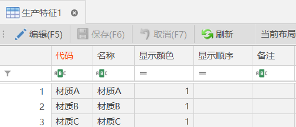

录入生产特征切换

录入制造订单生产特征

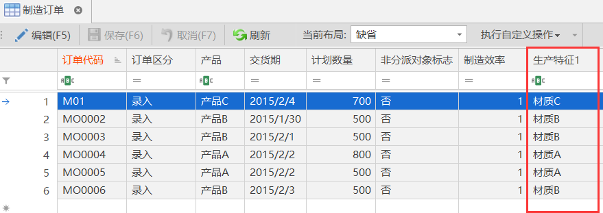

排产结果：

开料产品A到产品A、产品B到B，因为生产特征相同，所以没有切换时间；

开料产品B到产品A，因为没有设置材质B到材质A的切换时间，所以由产品B切换到产品A没有切换时间；

开料产品A到产品B、产品B到产品C，因为设置了生产特征材质切换。所以有120分钟的切换时间。

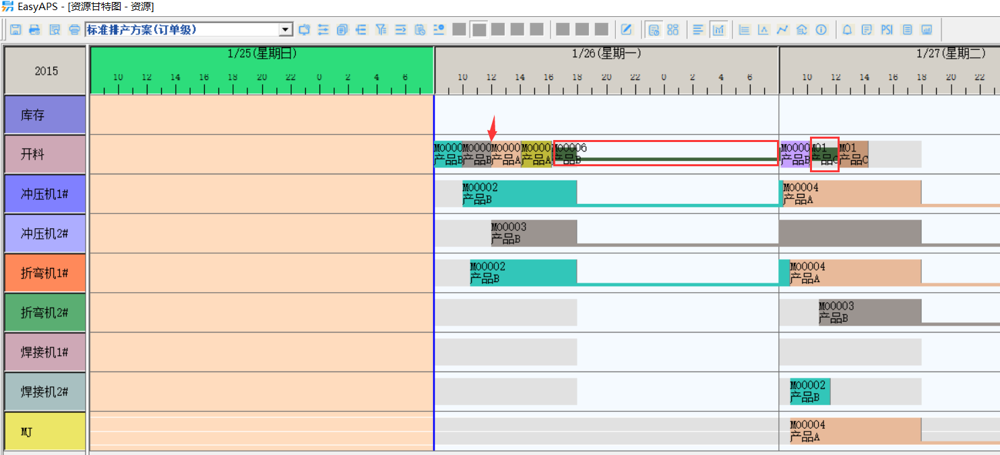

#### 5.4.2 资源切换

资源切换设定需要在前后工作中更换副资源情况下的设置时间。

**例：**

在折弯工序里产品C的制造由主资源的折弯机\#1和由副资源的MJ、MA的1台的组合来制造。

[工艺产能]


[资源切换]

[制造订单]


排程结果：


#### 5.4.3 物料切换

设定资源在生产不同物料要切换的时间的设置时间。

**例：**

[物料切换]

前物料代码不等于后物料代码的切换时间为120分钟。

排产结果：


### 5.5 排产计划数据

#### 5.5.1销售订单

录入销售订单数据，销售订单，即客户的购买订单，基本上销售订单本身不分派工作，而与制造订单，库存进行关联。订单的物料中有自动补充标志的时候，可以对订单进行自动补充。


销售订单的字段与制造订单的字段基本一致。

| 字段名称       | 字段说明                   |
|----------------|----------------------------|
| 订单代码       | 销售订单代码               |
| 订单区分       | 区分是补充订单还是录入订单 |
| 物料代码       | 所销售产品代码             |
| 订货时间       | 销售订单的订货时间         |
| 最早开始时间   | 订单分派的最早开始时间     |
| 交货期         | 订单的交货期               |
| 计划数量       | 订单的订货数量             |
| 优先度         | 订单的优先度               |
| 非分派对象标志 | 设定订单是否参与分派       |

#### 5.5.2制造订单

制造订单用于维护生产工单信息，指有哪些订单需要生产。


制造订单字段含义：

| 字段名称                 | 字段说明                                                                                                                      | 使用说明                                       |
|--------------------------|-------------------------------------------------------------------------------------------------------------------------------|------------------------------------------------|
| 订单代码                 | 订单的编码，不能重复                                                                                                          |                                                |
| 订单区分                 | 区分是自动补充订单还是录入订单                                                                                                |                                                |
| 物料代码                 | 订单的物料                                                                                                                    |                                                |
| BSAE物料代码             | 指定订单展开时使用的物料工艺产能。如果设定了BASE物料代码，则使用BASE物料代码展开订单，最终工序输出订单物料。                  | [例3BASE物料代码](#例3-base物料代码)           |
| 订货时间                 | 在排程逻辑里不参考它，但是表达式可以调用它。                                                                                  |                                                |
| 最早开始时间             | 设定排产最早可以开始的时间。                                                                                                  |                                                |
| 交货期                   | 订单的交货期                                                                                                                  |                                                |
| 计划数量                 | 订单的数量                                                                                                                    |                                                |
| 优先度                   | 设定优先度。在分派规则可设置按订单优先度分派。                                                                                | 例32[分派方向](#_例29分派方向)                 |
| 客户                     | 订单客户                                                                                                                      |                                                |
| 显示颜色                 | 在图表中显示订单颜色时的颜色编号。 用0～32设定。0的情况下自动决定颜色。                                                       |                                                |
| 显示顺序                 | 在图表中显示订单顺序时的顺序编号。                                                                                            |                                                |
| 分派方向                 | 设定订单分派方向。 F 正方向 ：将订单正向分派。  B 逆方向 ：将订单逆向分派。  P 遵从优先度 ：将订单按照优先度的分派方向分派。  |                                                |
| 非分派对象标志           | 设定订单是否参与分派。 0 否 该订单为分派对象。  1 是 该订单为分派对象以外的。                                                 |                                                |
| 制造效率                 | 设定订单的制造效率。 1表示100％，0的情况下默认为1。                                                                           |                                                |
| 一对一关联指定料号       | 对于已指定的料号，1对1的关系自动生成订单，并进行关联。设定为[\*]时，对所有品目自动生成订单。                                  | [例281对1关联指定料号](#例28-1对1关联指定料号) |
| 后订单                   | 可以指定前后工序的制造订单或工作，并为其生成关联对象来考虑时间制约。关联对象会连接到制造任务上。                              | 例26后订单                                     |
| 订单状态                 | X 未指定：该订单的实绩未指定。 T 开始生产：该订单已经开始生产。 B 结束：该订单结束                                            |                                                |
| 生产特征1                | 订单物料的生产特征1                                                                                                           | [例2生产特征、数值特征](#例2-生产特征数值特征) |
| 数值特征1                | 订单物料的数值特征1                                                                                                           |                                                |
| 开始时间                 | 订单开始生产的时间                                                                                                            |                                                |
| 结束时间                 | 订单生产结束的时间                                                                                                            |                                                |
| 实绩开始时间             | 实绩开始时间                                                                                                                  |                                                |
| 实绩结束时间             | 实绩结束时间                                                                                                                  |                                                |
| 实绩取得时间             | 实绩取得时间                                                                                                                  |                                                |
| 实绩数量                 | 取得的实绩数量                                                                                                                |                                                |
| 自动补充标志             | 预留字段                                                                                                                      |                                                |
| 用户指定订单数量固定级别 | 直接指定该订单的数量固定级别时使用                                                                                            | 例30数量固定级别                               |
| 订单种类                 | 显示订单的种类，默认为制造                                                                                                    |                                                |

#### 5.5.3 盘点库存

录入盘点库存数据作为供应数据。注意录入的盘点库存时点不能大于计划基准时间，同一个物料只能录入一行盘点库存。


| 字段名称     | 字段说明                               |
|--------------|----------------------------------------|
| 物料代码     | 物料的代码，具有唯一性                 |
| 订单代码     | 自动输入物料的代码作为订单代码         |
| 盘点库存时点 | 盘点库存时的时间，不能大于计划基准时间 |
| 库存数量     | 盘点的库存数量                         |

#### 5.5.4 计划外出入库

录入计划外出入库数据，如果录入正数是作为供应数据，如果录入负数是出库作为需求。


| 字段名称 | 字段说明                                                                       |
|----------|--------------------------------------------------------------------------------|
| 订单代码 | 计划外出入库的订单代码。                                                       |
| 物料代码 | 物料的代码。                                                                   |
| 交货期   | 物料外出入库的日期。                                                           |
| 计划数量 | 计划出入库的数量，如果录入正数是入库作为供应数据，如果录入负数是出库作为需求。 |

#### 5.5.5 工作

主菜单导航栏中单击[排产计划数据]-〉[工作]，打开工作明细表，本表是显示排产工作结果的一张表，记录订单对应的工作分派结果，工作是订单根据工艺路线展开每道工序形成的工作。


| 字段名称       | 字段说明                                                            |
|----------------|---------------------------------------------------------------------|
| 工作           | 根据订单代码和工艺产能的工序编号生成的工作代码。                    |
| 订单           | 显示工作来源的订单代码。                                            |
| 物料代码       | 显示工作制造的物料代码。                                            |
| 制造数量       | 显示工作的制造数量。                                                |
| 主资源         | 工作使用的主资源，取工艺产能所设定的主资源。                        |
| 制造开始时间   | 由分派结果得出工作开始制造的时间。                                  |
| 制造结束时间   | 由分派结果得出工作制造结束的时间。                                  |
| 制造时间       | 根据订单数量和主资源制造能力计算出的工作制造时间。                  |
| 前设置开始时间 | 该工作前设置开始的时间。                                            |
| 前设置结束时间 | 该工作前设置结束的时间。                                            |
| 前设置时间     | 前设置需要花费的时间，取工艺产能中前设置的值。                      |
| 后设置开始时间 | 该工作后设置开始的时间。                                            |
| 后设置结束时间 | 该工作后设置结束的时间。                                            |
| 后设置时间     | 后设置需要花费的时间，取工艺产能中后设置的值。                      |
| 交货提前期     | 交货提前期=工作结束时刻-工作开始时刻。                              |
| 开始时刻       | 有前设置时，为前设置的开始时间；无前设置时，为制造开始时间。        |
| 结束时刻       | 有后设置时，为后设置的结束时间；无后设置时，为制造结束时间。        |
| 分派标志       | 表示是否分派。                                                      |
| 分派方向       | 表示工作的分派方向。                                                |
| 任务or工作状态 | 表示工作的状态，有计划完毕、指示完毕、确定、开始生产、结束5种状态。 |
| 实绩数量       | 取生产报工录入的报工数量。                                          |
| 工序模板       | 取工艺产能的工序代码。代表工作展开所采用的工艺模板。                |
| 选定器         | 取工艺产能的任务选定器代码。代表工作所使用的任务选定器。            |
| 工序编号       | 取工艺产能的工序编号。                                              |
| 最后分派顺序   | 该工作最后的分派顺序。                                              |

#### 5.5.6 工作任务明细

主菜单导航栏中单击[排产计划数据]→[工作任务明细]，打开工作任务明细表；工作根据工艺路线设置可再细分为前设置任务、制造任务、后设置任务，资源锁定任务，工作任务明细是把工作拆解为多个任务进行详细显示。


| 字段名称 | 字段说明                                                                                                                                         |
|----------|--------------------------------------------------------------------------------------------------------------------------------------------------|
| 资源代码 | 系统根据工艺产能表维护的使用指令资源设定及资源选择策略分派的资源，代表工作任务所使用的资源。                                                     |
| 订单代码 | 工作任务来源的订单代码。                                                                                                                         |
| 工作代码 | 订单根据工艺路线展开的工作代码。                                                                                                                 |
| 任务类别 | 任务的类别，工作可以拆分为前设置任务、制造任务、后设置任务、资源锁定任务；另外还有配送任务、库存任务。                                           |
| 开始时间 | 任务的开始时间。                                                                                                                                 |
| 结束时间 | 任务的结束时间。                                                                                                                                 |
| 总工时   | 任务花费的总时间，单位为秒。前设置任务、后设置任务分别取工艺产能维护的前设置时间、后设置时间；制造任务根据订单数量和工艺产能维护的制造能力计算。 |
| 资源量   | 系统根据工艺产能表维护的必要资源量或者任务资源量解析的，代表这个任务分派时占用的资源量。                                                         |
| 数量     | 任务制造的数量。根据订单数量和工艺产能维护的输入指令的物料需求数量计算。                                                                         |

#### 5.5.7 物料需求明细

主菜单导航栏中单击[排产计划数据]-〉[物料需求明细]，打开物料需求明细表，物料需求明细是根据工作任务明细计算出对于每个任务的物料需求。


| 字段名称         | 字段说明                               |
|------------------|----------------------------------------|
| 料号代码         | 所需的物料代码。                       |
| 订单代码         | 需要该物料的订单代码                   |
| 工作代码         | 需要该物料的工作代码。                 |
| 订单or工作or任务 | 需求类别。有制造、配送任务、库存任务。 |
| 时间             | 物料的需求时间。                       |
| 数量             | 物料的需求数量。                       |
| 不足数量         | 需求数量-库存数量所得的欠料数量。      |

#### 5.5.8 订单关联明细

订单关联明细显示的是订单供需之间的关联关系，关联种类有订单之间关联、同一订单关联、后订单。订单之间关联是指不同订单的工作间物料及数量的关联对象；同一订单关联是指同一订单内的工作间物料及数量的关联对象。后订单关联是由制造订单维护的后订单属性形成的。


| 字段名称   | 字段说明                                               |
|------------|--------------------------------------------------------|
| 代码       | 发生关联的物料代码。                                   |
| 关联种类   | 订单关联的种类。有订单关联、订单之前关联、后订单关联。 |
| 数量       | 订单关联的数量。                                       |
| 左订单代码 | 供应方的订单代码。                                     |
| 右订单代码 | 需求方的订单代码。                                     |
| 左工作代码 | 供应方的工作代码。                                     |
| 右工作代码 | 需求方的工作代码。                                     |

#### 5.5.9 工作指示发布

发布已确定的工作，给车间下发计划。


1.  录入要发布工作的时间周期，
2.  勾选要发布工作的资源，
3.  查找符合条件的工作，
4.  发布工作指示，发布的工作为右边工作指示一栏的工作。

#### 5.5.10 工作指示一览

已成功发布的工作信息在工作指示一览表中查看。


-   删除已发布的工作：
1.  勾选要删除的工作，
2.  点击删除选中行，在弹出的询问框确定是否删除。


### 5.6 排产生产报工

#### 5.6.1 生产报工录入

车间按照生产指示生产，完成的实绩可以直接录入到EasyAPS中。不同的用户只能录入资源分配中有权限的资源的工作。

主菜单导航栏中单击[排产生产报工]-〉[生产报工录入]，打开生产报工录入画面。

-   生产报工新增：
1.  点击新增按钮，
2.  选择工作编号，
3.  选择工作状，完工是指该工作已全部生产完成；运行中是指该工作已完成一部分，还有一部分正在生产。

    

4.  输入报工数量，如果有报废品可输入异常数量.异常数量仅做一个记录，不影响排产。
5.  确认报工信息无误，点击提交，完成生产报工。


-   生产报工查询：
1.  选择查询条件，有报工日期、工作编号、资源编码、物料代码、报工数量、报工用户。
2.  点击查询按钮，查询出的报工信息在界面下边显示。


-   生产报工修改：如果生产报工有异常，需要对录入的生产实绩进行修改，可以点击修改按钮进行修改，确认修改的信息后点击提交。


-   生产报工删除：
1.  点击要删除的报工信息，
2.  点击删除按钮
3.  确认是否删除，点击“是”则删除该报工数据。


-   生产报工详情：点击详情按钮弹出生产报工详情窗口，方便查看。


### 5.7 报表中心

#### 5.7.1生产日计划

生产日计划是一个样例报表，根据多工序排产结果解析到天的日报表，可以查看每天的具体工作计划。

1.  输入要查询的时间段。
2.  只筛选已发指示的数据：勾线此选此选项则只查找已发布工作指示的工作；

    着重显示：勾选此选项则日计划数量表格会填充黄色。

3.  按条件查找日计划。
4.  查看结果后如果需要导出，可以点击Excel导出。


### 5.8 计划控制塔

此模块主要是排产和工作进度的分析和提醒功能。

#### 5.8.1 KPI分析

根据系统管理的[KPI设置](#KPI设置)显示统计结果，使用户可以通过查看图表快速知道生产的达成率。


#### 5.8.2 关键事件

根据系统管理设置的[任务提醒](#任务提醒)参数展示提醒信息。方便用户知道当日要生产的订单或延期订单等信息。点击消息可查看任务明细，任务明细可以导出Excel。


#### 5.8.3 生产进度

生产进度可以查看每个工作的生产进度，方便用户查看每个工作的完成进度。


#### 5.8.4 订单进度

订单进度可以查看每个订单的生产进度，方便用户了解订单生产情况。


### 5.9系统管理

此模块是排产易软件对全局的设置参数。

#### 5.9.1 排产方案管理

在排产方案管理可以新增排产方案，并设置排产方案参数。

新建排产方案

1．点击【新建方案】在弹出的画面新建方案名称。


2．增加排产方案菜单

①点击排产方案库；②点击要增加的方案名；③点击【+】添加。


3．增加排产方案内部命令

1.  点击要增加命令的方案；②点击要增加的排产命令；③点击【+】添加。


1.  调整方案
    1.  点击排产方案或排产命令，然后再点击，可以删除排产方案菜单或则排产命令。
    2.  点击排产方案或排产命令，然后再点击，可以把排产方案菜单或排产命令的顺序往上调；点击，可以把排产方案菜单或排产命令的顺序往下调。

        

2.  保存方案设置

    确定方案后，可以点击保存设置保存排产方案。


1.  编辑排产方案参数

属性设置说明

| **分派属性**                   |                                                                                                                                                                                                                                                                     |
|--------------------------------|---------------------------------------------------------------------------------------------------------------------------------------------------------------------------------------------------------------------------------------------------------------------|
| 按分派规则顺序排列             | 设置在各资源上的分派位置是否绝对按照分派规则。                                                                                                                                                                                                                      |
| 分割工作靠拢在一起             | 设定分割工作是否靠拢在一起，为了使某些分割的工作按照特定的分派规则重新进行分派，分割工作靠拢在一起可以设置为“否”。                                                                                                                                                  |
| 分派方法                       | 设定分派方法，有限能力分派还是无限能力分派。                                                                                                                                                                                                                        |
| 分派方向                       | 设定分派的方向，具体说明请查看[例32分派方向](#_例32分派方向)。                                                                                                                                                                                                      |
| 分派规则                       | 设定在排产时决定订单分派顺序的规则。                                                                                                                                                                                                                                |
| 分派失败时（资源锁定制约）     |  当未能满足资源锁定时候的应对方法。如果没有设置，就认为期间外强制分派。 期间外强制分派：把资源锁定制约相关的所有工作全部强制分派期间外。 忽视制约:忽视资源锁定制约而把最初试图分派的工作单独分派。 虚拟资源:把相互制约的所有工作分派在虚拟资源上。                  |
| 分派失败时（最大移动时间制约） |  当未能满足最大移动时间制约时候的应对方法。如果没有设置，就认为期间外强制分派。  期间外强制分派：把最大移动时间制约相关的所有工作全部强制分派期间外。 忽视制约:忽视最大移动时间制约而把最初试图分派的工作单独分派。 虚拟资源:把相互制约的所有工作分派在虚拟资源上。 |
| 分派停止条件式                 | 设定排程过程中想要中途停止分派时的条件式。                                                                                                                                                                                                                          |
| 分派资源                       |  分派评估值中最大资源。 评估值最大资源：分派评估值中最大资源。 优先资源：只分派资源优先度最高的资源。 当前资源：分派当前资源。首次分派的子工作会把分割前的工作分派的资源作为当前资源。工作未被分割时的情况和选择【出现顺序】时相同。 出现顺序：分派最先出现的资源。 |
| 更新关联/补充订单              | 设定通过订单展开命令是否进行关联，是否生成自动补充订单。                                                                                                                                                                                                            |
| 工作临时固定                   | 设定再排程时的临时固定工作方法。（[工作临时固定](#工作临时固定)）                                                                                                                                                                                                   |
| 忽视未分派的前后工序的工作     |  如果设定为[是]，就算关联的前后工序的工作未分派也会对其进行分派 否：分派时，等待关联的前后工作被分派。正向的时候等待前工序，逆向的时候等待后工序。 是：分派时，不等待关联的前后工作被分派。正向的时候忽视前工序，逆向的时候忽视后工序。                             |
| 起用原料库存制约               | 设定是否起用原料制约，如果起用，则物料表的[物料制约标志]需设定为“是”，原料不足的工作将分派虚拟资源。                                                                                                                                                                |
| 筛选订单                       | 设定订单的筛选条件。                                                                                                                                                                                                                                                |
| 筛选工作                       | 设定工作的筛选条件。                                                                                                                                                                                                                                                |
| 适用组合设置时间的设定         | 设定是否采用生产特征切换、物料切换表的设置。默认值为[是]。                                                                                                                                                                                                          |
| 锁定订单间关联                 | 设置是否锁定销售订单和制造订单之间的关联关系。                                                                                                                                                                                                                      |
| 严格遵守后资源制约             | 设定是否启用后资源制约，在某资源上进行工作时，限制其后面的工序进行的资源被称作后资源制约。（[后资源制约](#例16后资源制约)）                                                                                                                                         |
| 越过分派开始时刻时             | 逆向排序时越过工作分派开始时刻的过去方向分派的处理方法。                                                                                                                                                                                                            |
| 越过分派结束时刻时             | 正向排序时越过工作分派结束时刻的未来方向分派的处理方法。                                                                                                                                                                                                            |
| 越过最迟开始时刻时             | 逆向排序时越过工作最早开始时刻的过去方向分派的处理方法。                                                                                                                                                                                                            |
| 越过最早结束时刻时             | 正向排序时越过工作最迟结束时刻的未来方向分派的处理方法                                                                                                                                                                                                              |
| 允许工作分割                   | 设定展开订单/工作分割时是否进行工作分割。默认为[是]。                                                                                                                                                                                                               |
| 制造时间计算                   |  设定制造时间的计算方法。 基于主资源：基于主资源的能力值 最长时间的资源：主资源和全部的副资源的能力值中，基于制造时间最长(最低能力值)的能力值。 最长时间的副资源：全部副资源的能力值中基于制造时间最长(能力值最低)的能力值。                                        |
| 制造效率                       | 设定制造效率。1为100％。0的情况时默认为1                                                                                                                                                                                                                            |
| 资源选择策略                   | 设定在分派时资源的选择规则。（[资源选择策略](#6325资源选择策略)）                                                                                                                                                                                                   |
| **时间属性**                   |                                                                                                                                                                                                                                                                     |
| 分派开始时间                   | 设定分派期间的开始时间。                                                                                                                                                                                                                                            |
| 分派结束时间                   | 设定分派期间的结束时间。                                                                                                                                                                                                                                            |
| 用户指定最早开始时刻           | 指定工作分派最早开始时刻。                                                                                                                                                                                                                                          |
| 用户指定最迟结束时刻           | 指定工作分派最迟结束时刻                                                                                                                                                                                                                                            |

①点击要编辑的方案菜单；②点击属性设置，在弹出的界面编辑参数。


参数有的是下拉选框，选择后确定即可。

有些是要配置选择的。例如分派规则，要点击【…】后进入编辑画面编辑。


如下图，点击可以新增自定义的分派规则。


如下图，点击可以编辑分派规则。


资源选择策略设置：

点击【…】进入资源策略设置画面

1.  点击；②设置策略名称；③选择策略对象（资源）；④确定；
2.  点击右边的；⑥选择评估评估方案；⑦点击保存，完成资源选择策略的新增。

另外，点击可以新增自定义评估方案，点击可以修改自定义评估方案。


注：参数设置完毕后，记得点击【保存设置】保存方案

运用排产方案

新增的排产方案可以在排产引擎看到，可以使用该排产方案进行排产。


内部命令说明

订单收集：收集所有订单（包括制造、销售、库存）的数据。

订单筛选：根据订单筛选条件对收集的订单进行筛选。

解除分派：将已排产分派的订单数据进行解除分派操作，方便重新展开工作和任务数据。

订单展开：将制造订单根据工艺产能表的工艺流程展开成工作。

分派实绩工作：分派已经存在实绩（完工回报）的工作。

分派固定工作：分派工作状态为固定的工作。

分派实绩制约工作：分派与实绩工作存在制约的相关工作。

分派固定制约工作：分派与固定工作存在制约的相关工作。

订单分派/关联：进行游离的工作的分派、关联。

分派调整：调整被分派工作的一部分分派。

工作收集：收集订单展开的工作。

工作筛选：筛选收集到的工作。

计划评估：评估排程结果。

删除数据：能够删除条件指定的。如下图，点击删除数命令，然后点击属性设置可以设置删除条件。


属性编辑：设定编辑订单、工作、资源、物料的属性的表达式。如下图，点击属性编辑命令，然后点击属性编辑可以设置。


执行存储过程：调用数据库的存储过程。点击执行存储过程命令，然后点击属性编辑，在弹出界面设置存储参数。


