## 2a数据原型的制作

-   产品构成

    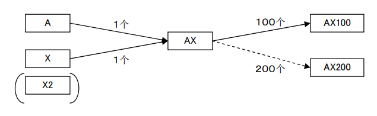

    BX100、BX200、CX100、CX200 与 AX100、AX200 的结构相同。

-   工序图
```
M1 --\>切割 --\>加工 --\>检查1 --\> A

M1 --\>切割 --\>加工 --\>检查1 --\> B

M1 --\>切割--\>加工 --\>检查1 --\> C

M2 --\>成型 --\>检查2 --\>X

A, X --\>组装 --\>检查3 --\>AX

B, X --\>组装 --\>检查3 --\>BX

C, X --\>组装 --\>检查3 --\>CX

AX --\>包装 --\>AX100

AX --\>包装 --\>AX200

BX --\>包装 --\>BX100

BX --\>包装 --\>BX200

CX --\>包装 --\>CX100

CX --\>包装 --\>CX200
```
### 2a1 用工艺产能输入模板数据

工艺产能是设定模板数据（制造BOM）的表。让我们使用排产易的工艺产能来设定制造BOM。  
1.从菜单的[排产基础数据/工艺产能]打开工艺产能表。  
2.输入项目  
```
■ 物料代码 （输入完成品的物料代码）。
■ 工序编号 （工序编号应该从先头工序到最终工序由小变大）。
■ 工序代码 （输入工序代码）。
■ 指令种类 （输入指令种类）。
输入指令 （输入指令是指工序中跟输入物料相关的指令）。
■ 指令代码 （缺省值为 In，可以设定任意代码。）。
■ 物料or资源代码（输入工序中输入的输入物料）。
■ 制造 （设定制造一个单位的物料所需要的输入物料的数量）。
■ 接续方法 （设定工序之间的接续方法）。
■ 移动时间 MIN （设定工序之间需要留出的最小时间）。
使用指令
■ 指令代码 （主资源缺省值为 M，副资源为S）。
■ 物料or资源代码（输入使用的资源）。
■ 前设置 （输入前设置中需要的时间）。
■ 制造 （输入制造中需要的能力值和能力单位）。
■ 后设置 （输入后设置中需要的时间）。
```
3.半成品A的工序流程图

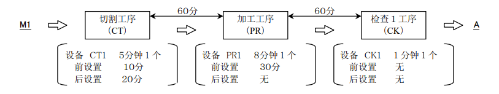

半成品A的工序、设备、能力如上，制造所必要的输入物料数量在全部工序中设定为1。根据上面的信息设定制造BOM，其结果如下图所示：

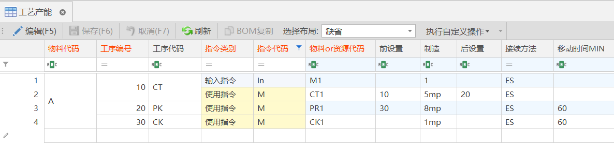

半成品A的工艺产能

### 2a2 班次的设定

1.设定班次。班次用于设定一天中工作时间段的模式。

输入项目

代码 （设定班次形态的名称）。

模式 （输入班次的出勤时间，输入时用分号隔开）。

2.设定从 8:00 到 18:00 出勤、并有一个小时的午休的模式，代码为 S1。

从菜单的[排产基础数据/班次]中打开班次表的界面，设定上面的出勤模式。

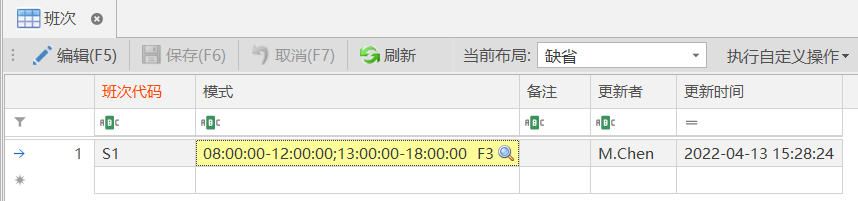

班次的设定结果

### 2a3 生产日历的设定

1\. 设定生产日历。生产日历设定每个资源/每天的出勤模式。

输入项目

资源 （\*表示全部资源，也可以对各个资源设定日历。）

日期/星期 （设定日期。既可以直接设定日期，也可以设定星期或者用短横线来设定范围。）

班次 （设定日历的班次）

优先级 （设定日历记录的顺序。优先级大的被应用。）

2\. 这次对所有资源的所有日期设定为班次S1。

从菜单的[排产基础数据/日历设置]中打开生产日历表的界面，设定上述的生产日历信息。

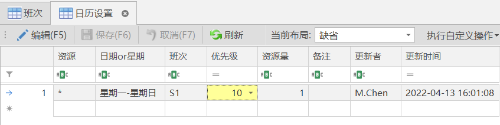

生产日历的设定结果

### 2a4 资源表、物料表的设定

1\. 资源表的数据输入。

为了更容易查看资源甘特图，依照工序的流程输入显示颜色和显示顺序。

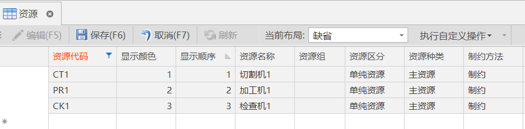

资源表的设定

2\. 物料表的数据输入。

为了更容易确认物料，请输入显示颜色和显示顺序。

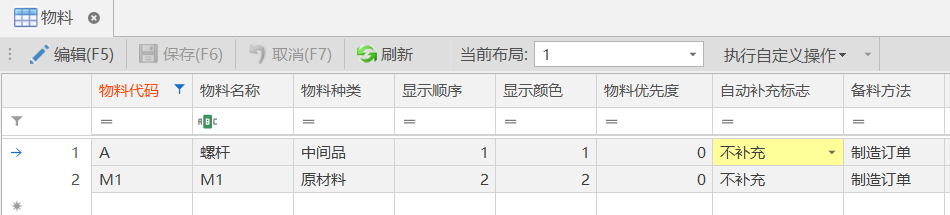

物料表的设定

### 2a5 计划基准时间、显示开始时间的设定

1\. 设定计划基准时间。

计划基准时间为其它时间的基准时间，一般指排程时的时间。如果要定义其它时间，一般直接输入或则间接取从计划基准时间开始的相对时间进行定义。

这次将计划基准时间设定为2003/10/01。

2\. 设定显示开始时间。

显示开始时间是开始显示图表的时间，这次设定过去的显示天数为 2 天。

选择菜单的「环境设置/期间设置」。

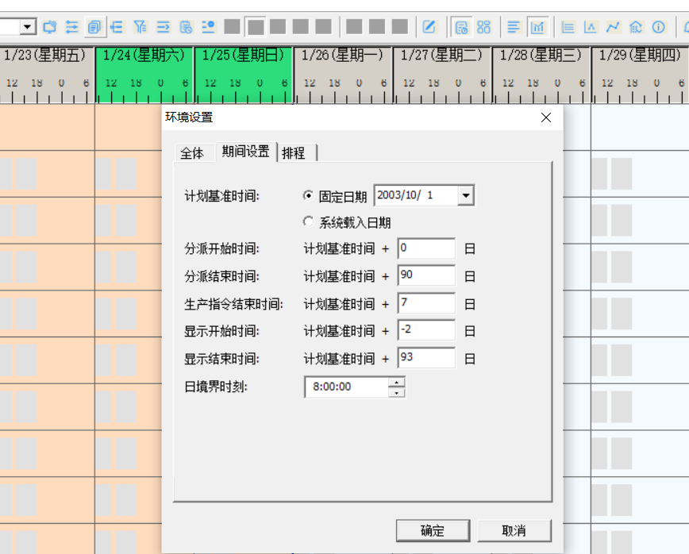

计划基准时间、显示开始时间的设定

### 2a6 副资源（作业员）的设定

设定副资源(作业员或夹具)。副资源占用和主资源相同的时间。

1\. 在CK工序里设定检查员（CKR）。在工艺产能增加使用指令。

2\. 在指令代码里设定S0。在[物料or资源代码]里设定资源[CKR]。因为[CKR]在制造中使用，所以在制造栏里输入和CK1相同的值。输入[0]则意味着[配合主资源的资源能力的值]。

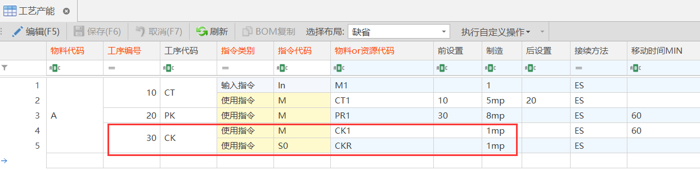

副资源的设定

3\. 在资源表上输入在工艺产能中所输入的资源CKR的显示颜色和显示顺序。

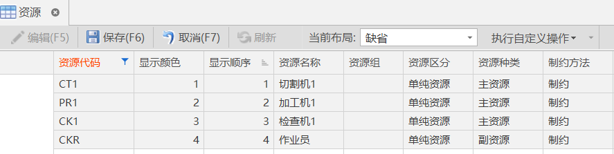

4\. 录入订单。

录入订单数量和交货期也和先前一样，设定数量是100、交货期是2003/10/31。

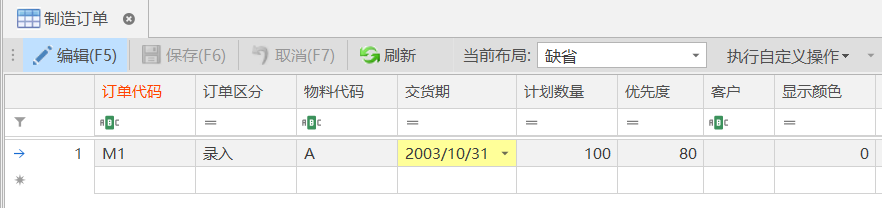

排程：我们可以看到资源CKR和资源CK1同时分派。对1个工作，计划使用资源CK1（主资源）与资源CKR（副资源）2个资源。

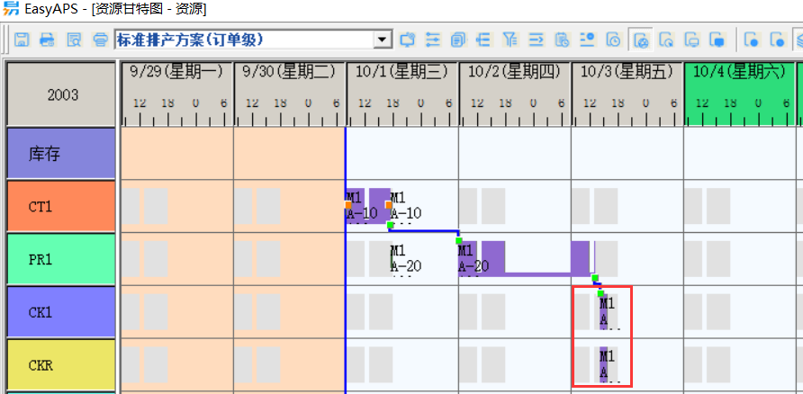

### 2a7 内设置资源的设定

设定内设置资源。能够设定进行设置工作的作业员等，这样的资源称为内设置资源

1\. 在PR工序里设定资源PRIN作为内设置资源。

2\. 和追加副资源时一样，在PR工序里追加使用指令。指令代码设定为S0。

在[物料or资源代码]里设定资源代码[PRIN]。

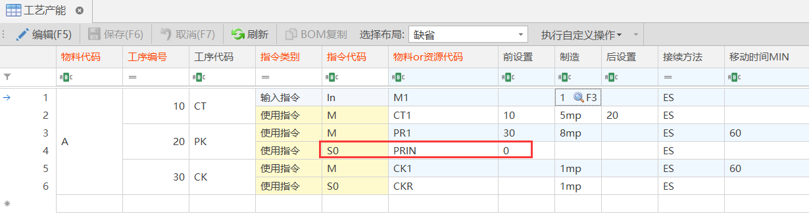

3\. 因为内设置资源 PRIN 进行主资源「PR1」的内设置工作，所以资源的显示顺序依此设定。

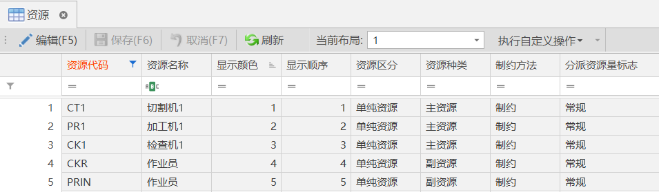

4\. 运行排产,数量和交货期的设定和先前一样。

内设置资源[PRIN]在资源[PR1]发生设置的时候分派，制定出的计划使之完成设置工作。

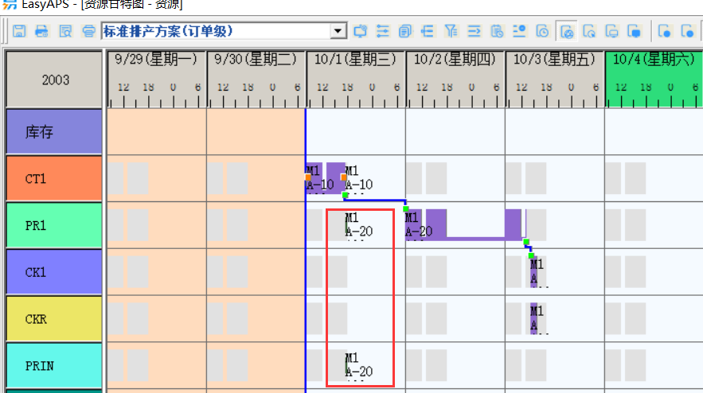

### 2a8 外设置资源的设定

设定外设置资源。把切割机 CT1 的前设置和后设置切换为外设置。

1\. 在 CT 工序里输入外设置资源 CTS。

在 CT 工序里追加[使用指令]。[指令代码]设定为 S0，在[物料or资源代码]里设定资源代码[CTS]。把在资源 CT1里所设定的前设置时间和后设置时间移动到资源 CTS 上。

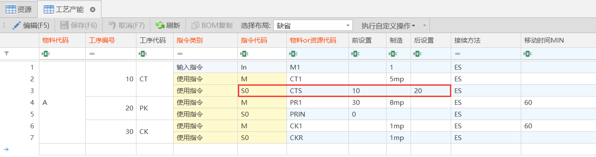

2\. 设定资源的显示颜色和显示顺序。

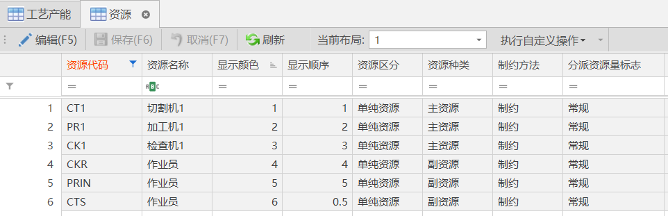

3\. 运行排产

在资源CT1上所分派的内设置变成外设置在资源CTS上分派。


### 2a9 设定组装供需以后的模板数据

设定组装工序以后的模版数据。

1\. 导入数据，如下所示，录入了品目X、AX、AX100的模版数据。

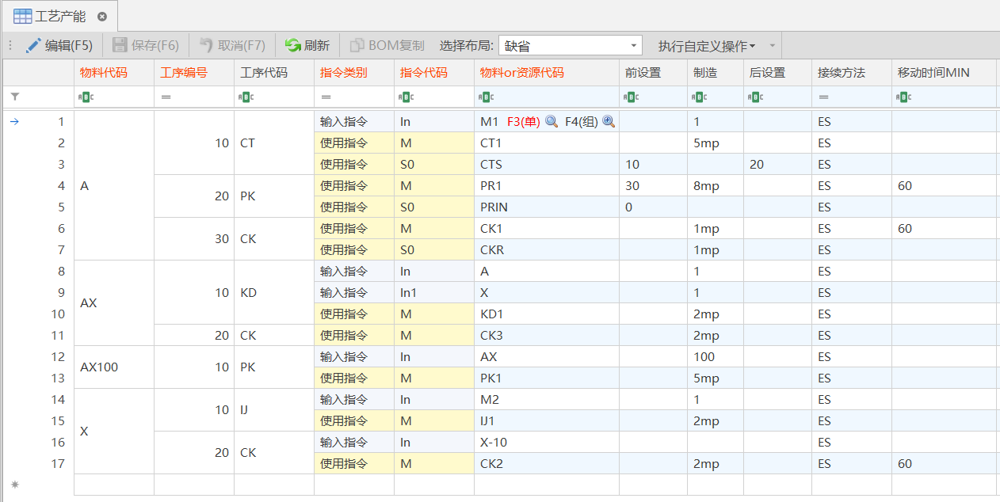

### 2a10 输入制造订单，进行排程

输入制造订单，重新排程。

1.  追加品目X、AX的订单。

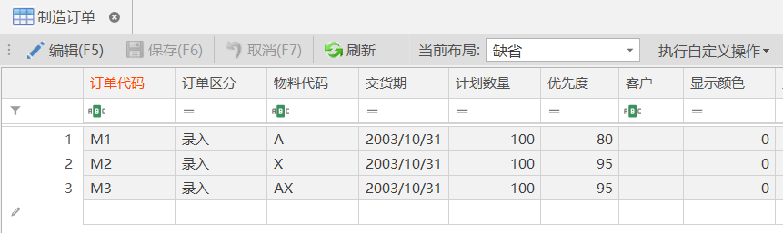

1.  接着重新排程,所追加的2个订单也已分派，订单之间关联了起来。

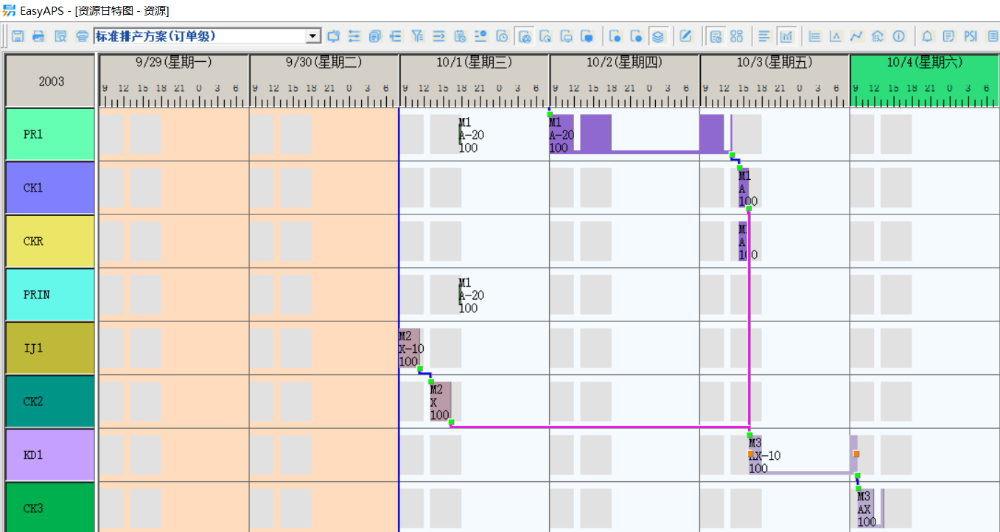

1.  追加AX100的订单。

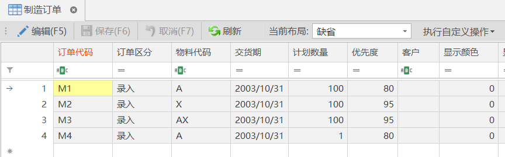

4\. 重新排程。

于是，新追加的订单M4也与现有的订单关联起来了。

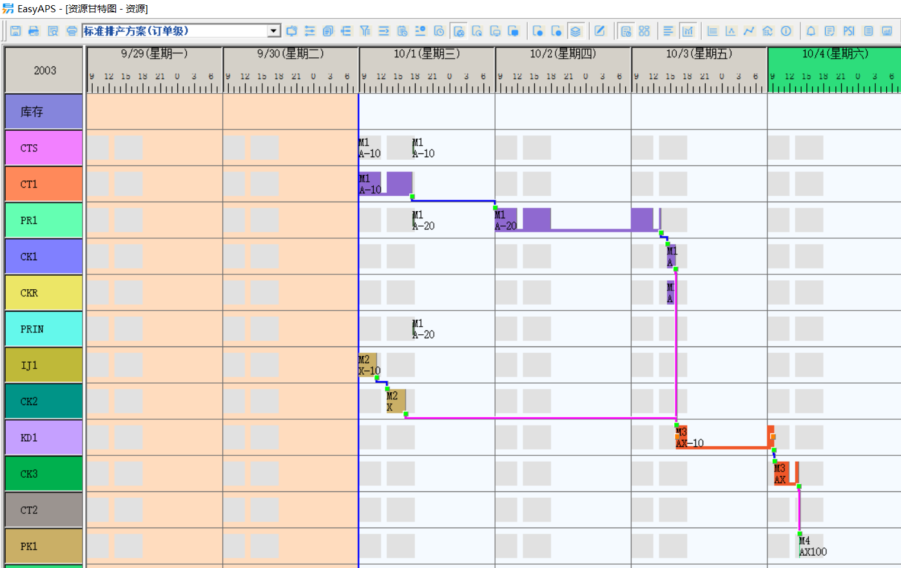

### 2a11 参数化BOM

哪怕是同1个产品，也会发生由于客户等条件变化而使用的原料或部品也变化的情况。这种情况下，可以在工艺产能里，对根据条件而变化的原料或部品设定条件表达式，以此在1个物料上可以指定多种投入物料。通过从订单设定条件（参数），可以用符合条件的模版数据展开订单、进行分派。

这种工艺产能（制造BOM）的设定称为参数化BOM。

AX通常螺钉（半成品A）和螺帽部品X装配而成，假设也可以用别的螺帽X2来装配成AX。我们可以用参数化BOM进行设定。

1\. 把判断螺帽的属性追加到订单。

※可以利用现有订单的属性设定判断条件。

1.1.打开订单表

1.2. 在表格左上角右键，打开表格设置。

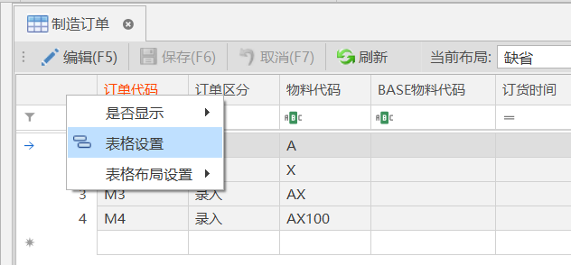

1.3. 设置字段ID[UserStr1]的自定义显示为螺帽。

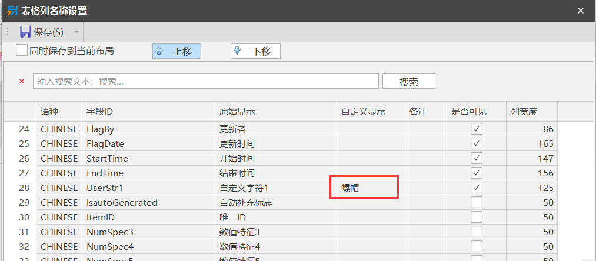

1.4. 点击“保存”按钮关闭对话框，就在订单表里追加了新属性“螺帽”。

然后，在这个属性里设定所用的螺帽种类。

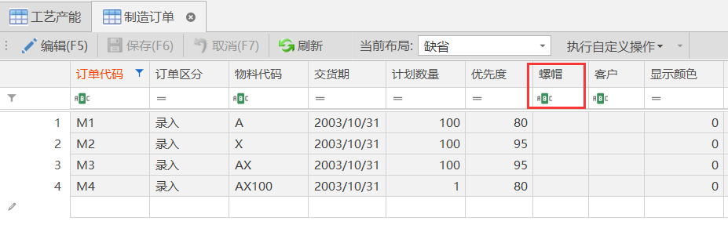

2.如下所示，设定 X2的制造BOM。

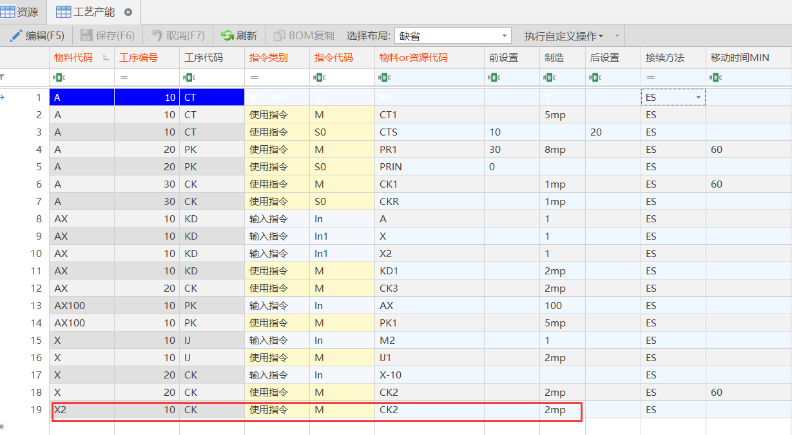

1.  在工艺产能，如下所示，在AX的KD工序追加输入指令行，这样，在AX上输入的有X 和 X2。

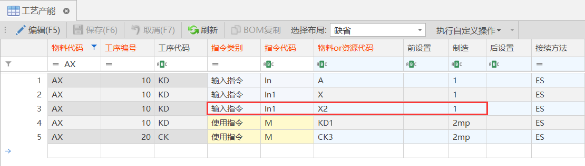

4\. 为了根据订单的螺帽的值切换输入品目，设定X输入指令的指令有效条件表达式。

4.1.1 在AX的KD工序里，点击X输入指令的指令有效条件里的F3按钮。

在表达式编辑对话框里，设定

ME.UserStr1=='X' \|\|FValid(ME.UserStr1)==FALSE

表达式。意思是，如果订单的螺帽设定为“X”或者空的，就在AX上使用X。

※FValid函数是排产易的内部函数，在参数里所设定的属性如果有值则返回TRUE，如果没有则返回FALSE。

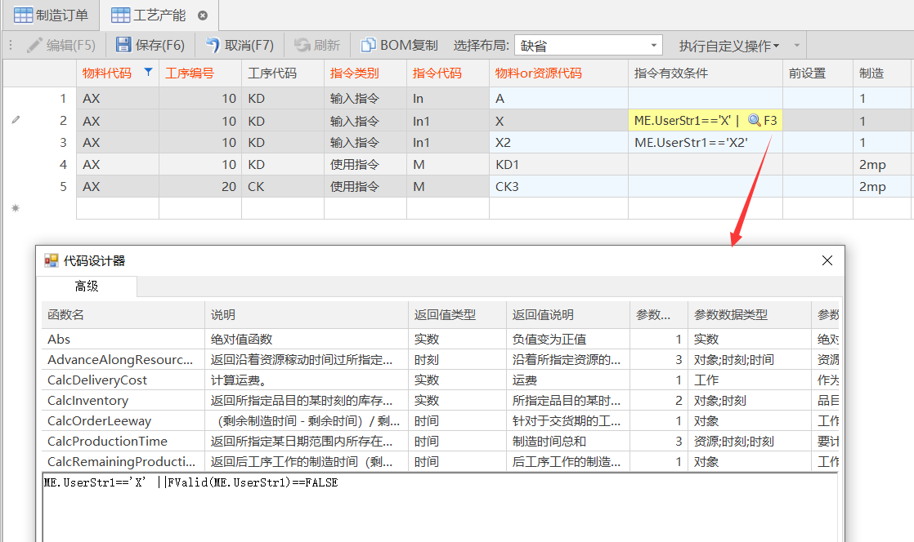

5\. 为了根据订单的螺帽的值切换输入品目，设定X2输入指令的指令有效条件表达式。

5.1.1 在AX的KD工序里的X2输入指令的指令有效条件中设定

ME.UserStr1=='X2'

表达式意思是，如果订单的螺帽设定为“X2”，就在AX上使用X2。

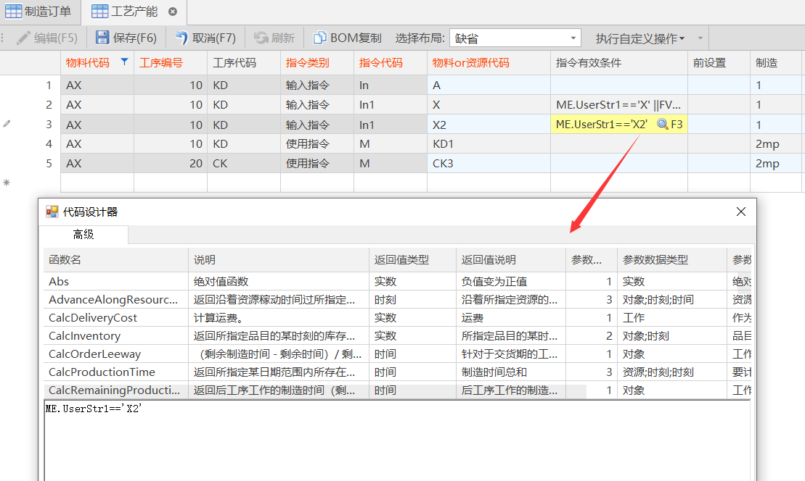

6\. 追加部品X2的制造订单。

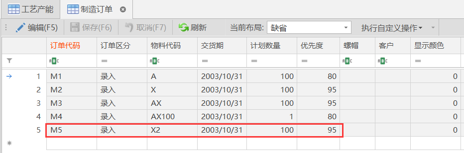

7\. 将AX的制造订单的「螺帽」设定为“X2”。

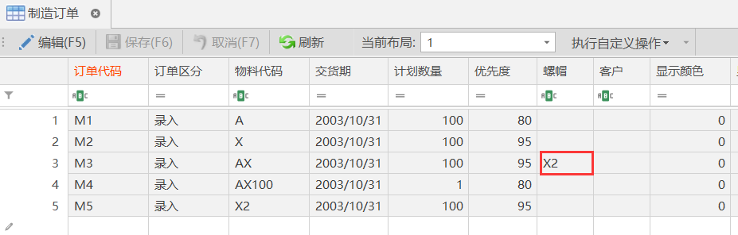

重新排程。于是，按照条件AX的订单与X2的订单关联了起来。

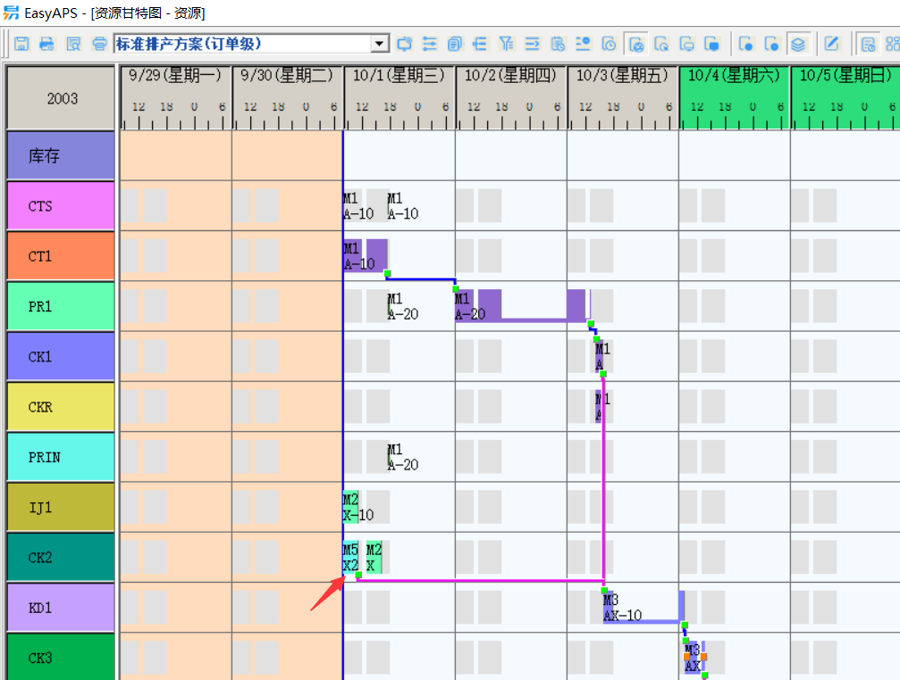

8\. 这次反过来将AX的制造订单的「螺帽」设定为“X”。

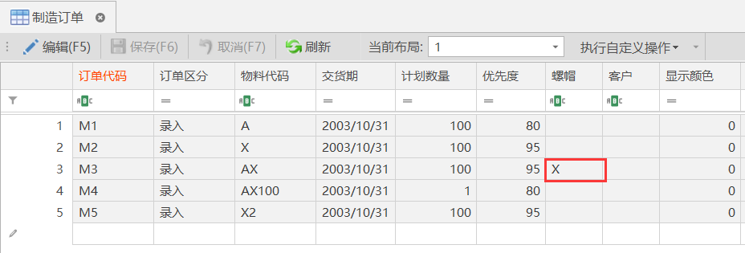

重新排程。于是，按照条件AX的订单与X的订单关联了起来。

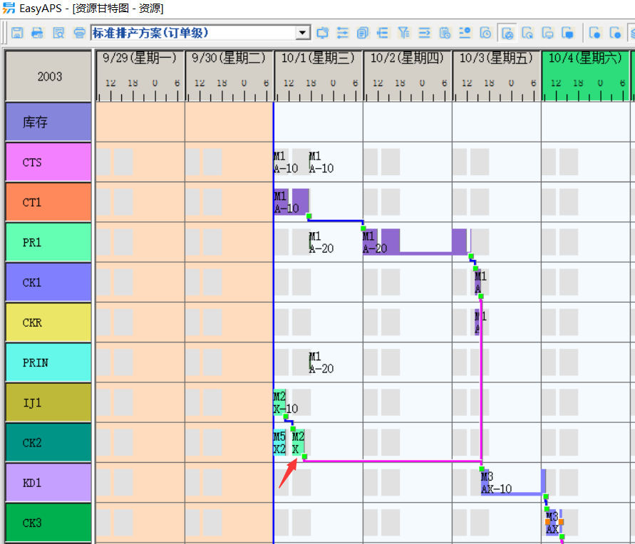

可见，有2个部品构成的AX能够在1个工艺产能里设定，根据条件来分别使用。

### 2a12 技能表

技能表是矩阵似的录入各作业员的技能，并且反映在排程过程。它使有关作业员技能的制造BOM的录入和维护变得非常简单，录入的数据量大幅度地减少。

在当前的设定里，部品X和X2是用资源CK2（即检查作业员）检查的。把检查作业员增加到３人，根据作业员的检查技能：

-   能否制造部品X、X2
-   检查速度的快慢（熟练者能够短时间内检查完）

设定技能表。

1.  打开资源表，如下所示，追加资源CK2-A、CK2-B和CK2-C。已设定的CK2保持不变，作为资源组使用。设定CK2-A、CK2-B、CK2-C的资源组为CK2。

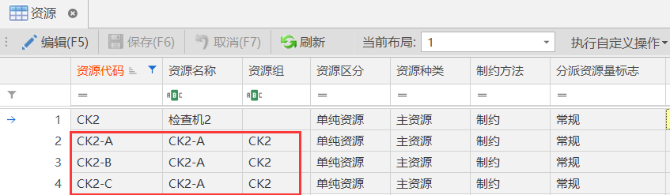

1.  为了资源甘特图便于观察，如下所示，设定CK2-A、CK2-B、CK2-C的显示颜色和显示顺序。

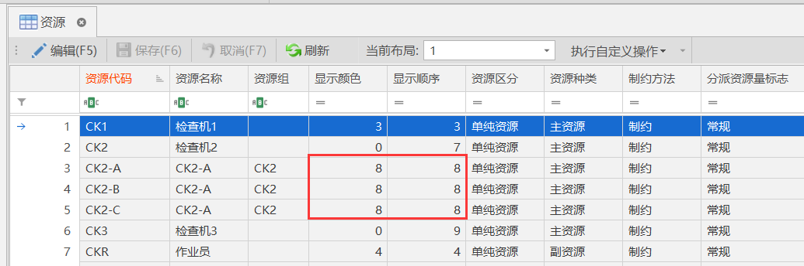

3\. 如果技能值设定为大于等于「1」，就能够检查。

设定CK2-C的技能1和技能2的值为1，使之能够制造X和X2。

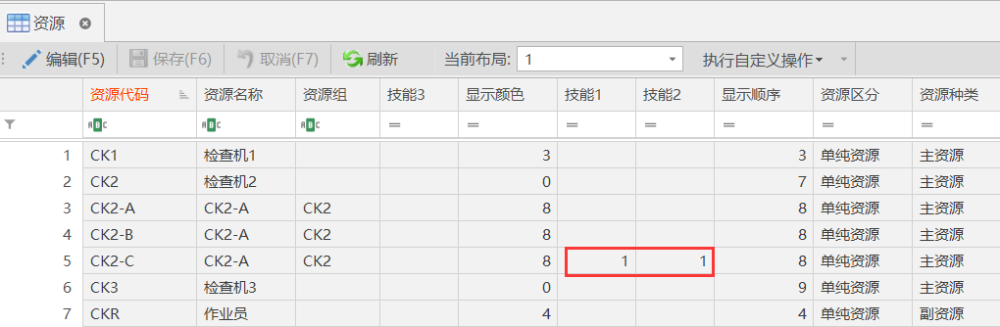

4\. 设定资源有效表达式

在品目X的CK2的资源有效条件式里

ME.X检查技能\>=1

在品目X2的CK2的资源有效条件式里

ME.X2检查技能\>=1

如上设定。这样，如果X检查技能（技能1）大于等于1就能够分派X，如果X2检查技能（技能2）大于等于1就能够分派X2。

※在资源有效条件式里的「ME」指的是资源。

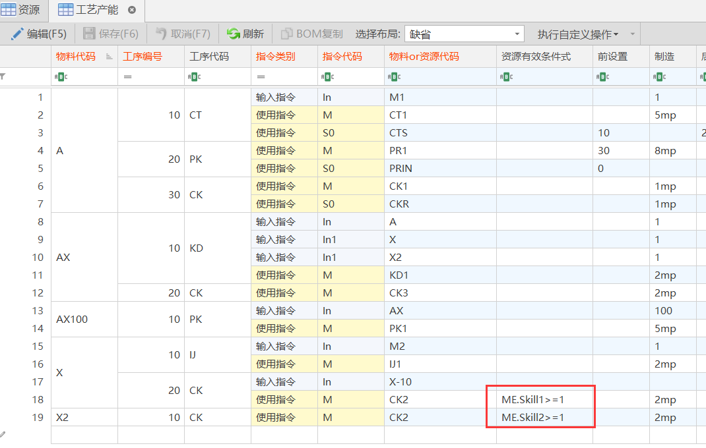

7\. 重新排程，在资源甘特图上确认分派结果。

在制造BOM设定里，虽说资源组CK2里面的资源（CK2-A、CK2-B、CK2-B）都可以分派，但是在资源有效条件式里设定了技能值必须大于等于1。

结果，品目X和品目X2都分派到CK2-C上。

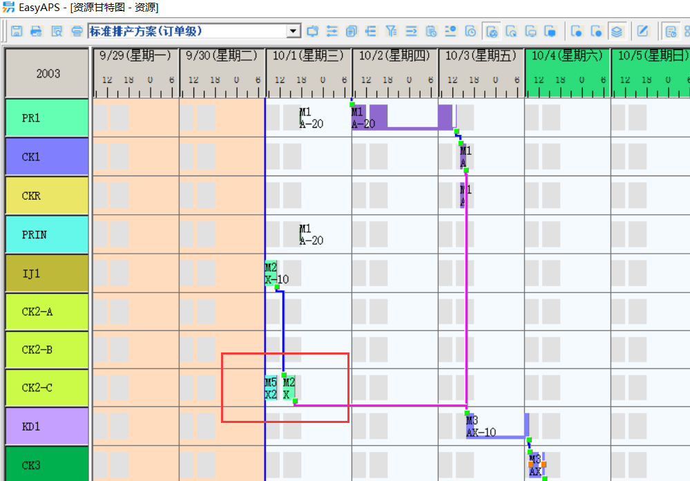

8\. 现在改变作业员的技能。

设定CK2-A能够检查品目X，CK2-B能够检查品目X2。把技能值

CK2-A X检查技能为2

CK2-B X2检查技能为2

如上变更。

这样，就会变成品目X分派到CK2-A上，品目X2分派到CK2-B上。

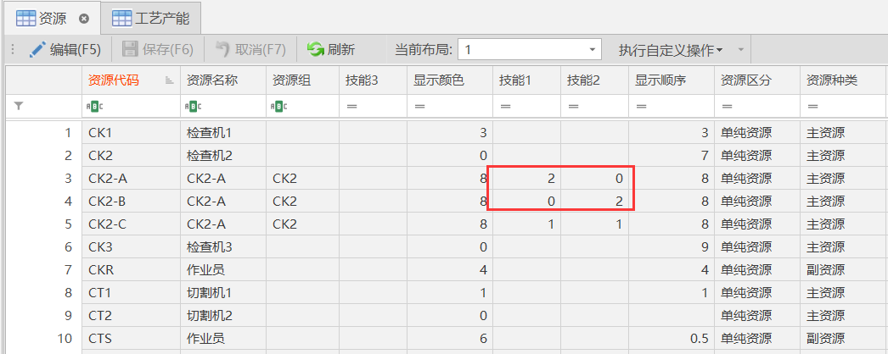

9\. 重新分派，在资源甘特图上确认分派结果。

变更技能设定的结果显示，品目 X 分派到 CK2-A 上，品目 X2 分派到 CK2-B 上。

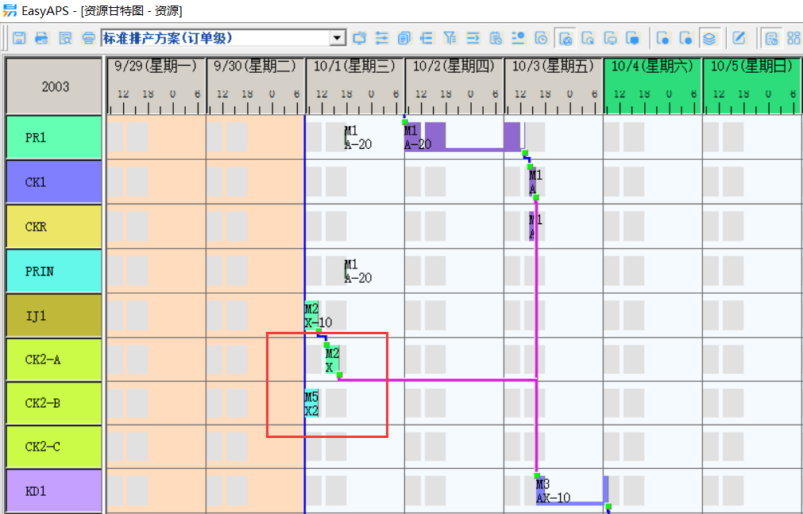

10\. 根据技能值可以设定能否分派。

下面将技能值反映到能力上。在工艺产能里，把品目X和X2的使用指令模版CK2的能力做如下变更

2mp/OTHER.Skill1

2mp/OTHER. Skill2

在使用指令模版的制造的表达式里“OTHER”同“ME”一样表示对象。在[能力]里“OTHER”指的是要分派的资源，因此在上述的表达式里技能值越大制造时间越短。

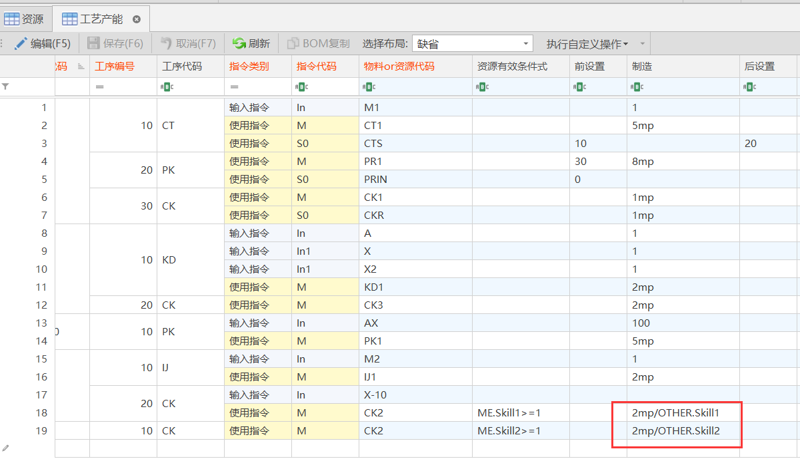

11\. 重新排程,在资源甘特图上确认分派结果。

技能值反映到能力上的结果是工作的时间缩短了。

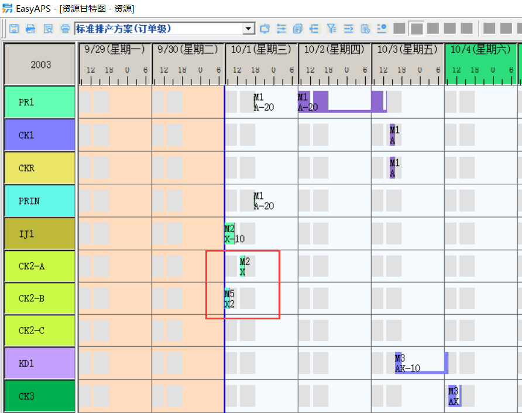

这样使用排产易 BOM的模版数据就设定完了。
