## 2c 命令与排产方案

**命令**

命令是排产易的一种对象，其特征是[执行(什么)]。命令的种类有：分派工作的命令、展开订单的命令、调用存储过程的命令等。命令和排产易的其它对象一样也为阶层结构。执行这种阶层结构的命令时，按照排列在阶层结构内的顺序依次执行。

**排产方案**

排产方案为了制定计划（排程）而设定的方案。可以在排产方案里设定制定计划（排程）时所必需的命令。

下图是预先设定的排产方案参数的构成图。

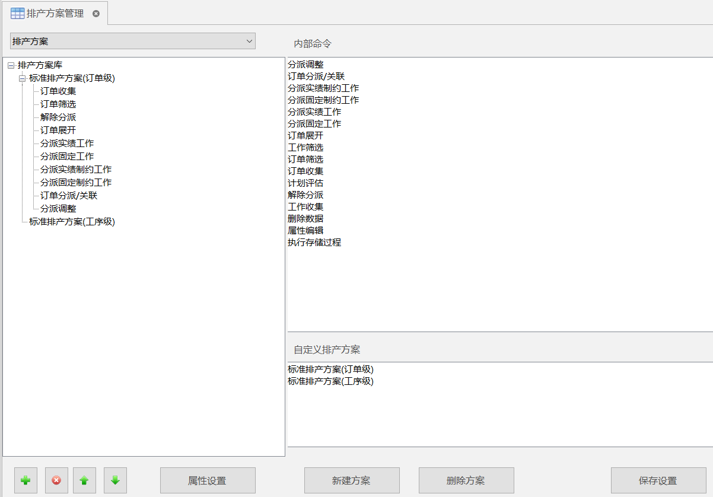

执行常规排产方案时，按照「订单收集」→「订单筛选」→「解除分派」……的顺序，执行所登录的内部命令。关于内部命令的详细介绍请参照帮助文档。

### 2c1 设定分派规则

1\. 首先，在订单表里如下图所示输入订单 01、02、03，重新排程。

2\. 在消息窗口里确认分派的顺序。可以看到：按订单优先度的高低顺序分派的。

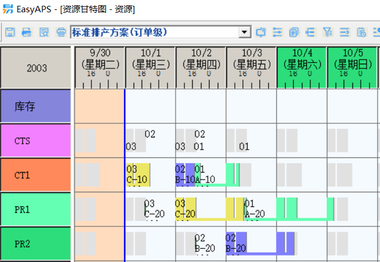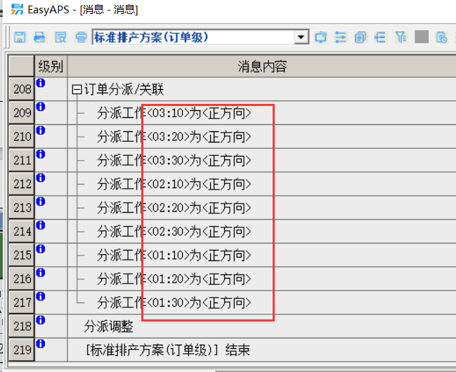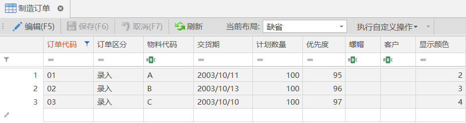

1.  点击排产方案管理的按钮，选择分派规则设定对话框。

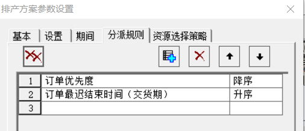

在这里，分派顺序取决于所设定的分派键的顺序。根据这一设定，订单优先度高的工作先分派。如果有多个优先度相同的订单，那么交货期早的先分派。

1.  在此，如果将订单交货期的键排到第一行，则相反地交货期早的先分派。交货期相同就开始以订单优先度作为顺序的基准。要将订单交货期排到第一行：

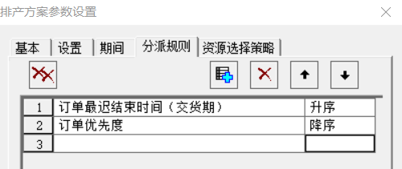

1.  重新排程。在消息窗口里可以看到从交货期早的订单开始分派的。

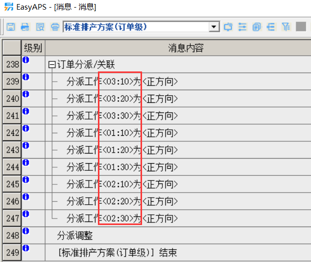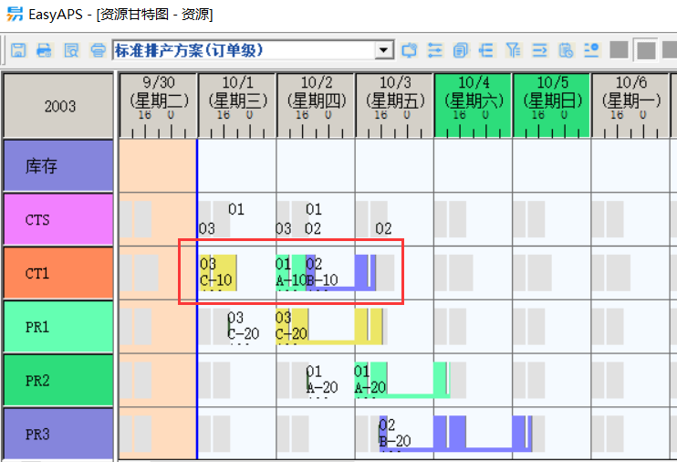

### 2c2 设定评估表达式

工作有多个候补资源的时候，排产易使用评估式作为资源的选择基准。要设定评估式，先选择排产方案参数设置，然后在属性窗口的评估式属性里设定值。

在这次的数据里第一和第三道工序有副资源，其候补资源有Oper1和Oper2。另外，第一道工序的主资源有两个候补资源CT1和CT2。

1.  确认制造 BOM 的内容。

    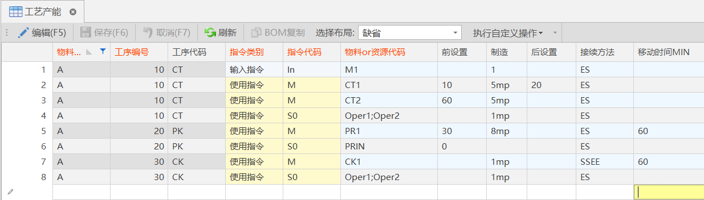

2.  在资源表中确认 CT2、Oper1、Oper2 的显示颜色、显示顺序。

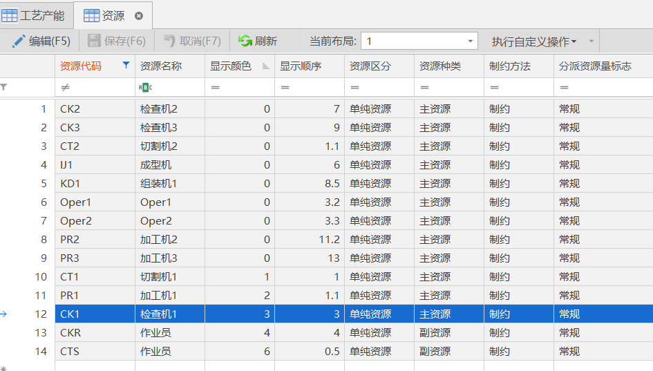

1.  确认在订单表里是否设定了 10 个订单。

    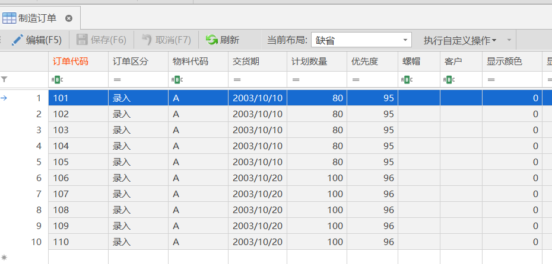

4\. 让我们确认排产方案参数的评估式。

点击排产方案参数设置按钮，接着点击资源策略,点击可以确认所选评估式的各个权重的设定值。

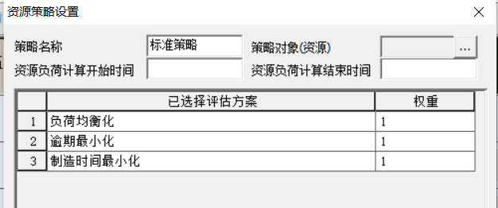

1.  负荷均衡化、逾期最小化、制造时间最小化的权重设定为１。这样，如果重新排程，那么在分派工作的过程中候补资源有多个的时候，排产易会选择
2.  造能力高且负荷小的资源。其结果，以某种程度分散负荷而将工作分派到资源CT1・CT2和Oper1・Oper2上。

常规下评估式适用于所有资源，但是如果在评估式的对象资源属性里设定了资源，那么该评估式就只适用于指定的资源。

7\. 现在我们执行更高级的排程。假定还是希望Opr1和Opr2作业员自己切割后自己检查，让此规则反映在计划参数中。

7.1. 在排产方案参数设置修改资源选择策略。

7.2. 在对象资源属性里录入 Oper1 和 Oper2。

7.3. 在相同订单优先属性和负荷均衡化属性里设定1。

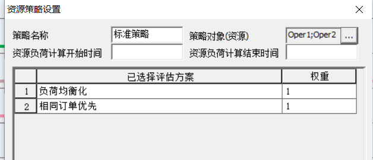

1.  重新排程，在资源甘特图上确认分派结果。可以看到不论哪个订单，切割工序和检查工序的副资源都在同一个资源上。

    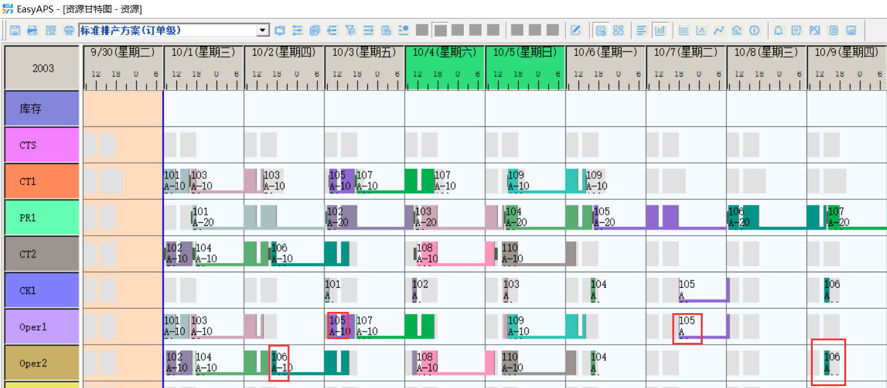

### 2c3 订单筛选、期间设定、复合排程

在这次数据里所登录的订单中，有交货期为 10 日和 20 日的订单。立刻制造 20 日的订单有些过早，因此设定交货期为 20 日的订单在 11 日以后分派。

1.  这样分成两个计划参数进行设定，以多个步骤制定计划。为了更明显地看到后面分派的结果。

1.1新增排产方案ABC，在排产方案ABC下新建方案10。

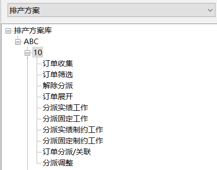

1.2设置订单筛选。在属性选择交货期，在条件里选择[小于]，在值里录入\#2003/10/11\#，按确认按钮。

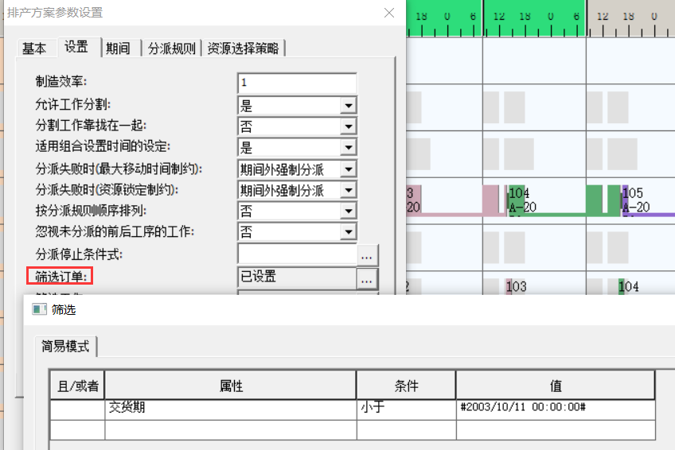

1.  重新排程，于是只分派交货期早于 11 日的订单。

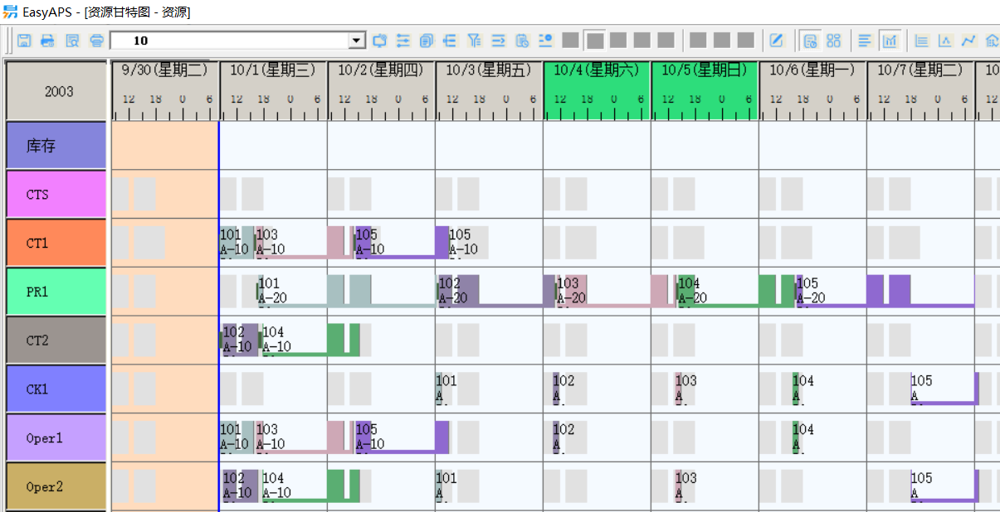

1.  接下来制作分派剩余订单的计划命令
    1.  在排产方案ABC新建方案20。

        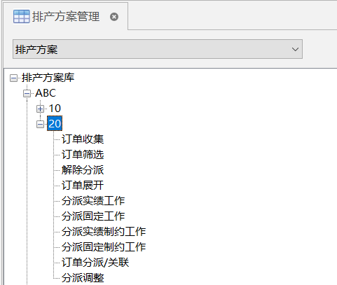

2.2.设置订单筛选，在属性里选择[交货期]，在条件里选择[大于]，在值里录入\#2003/10/11\#，最后按确认按钮。

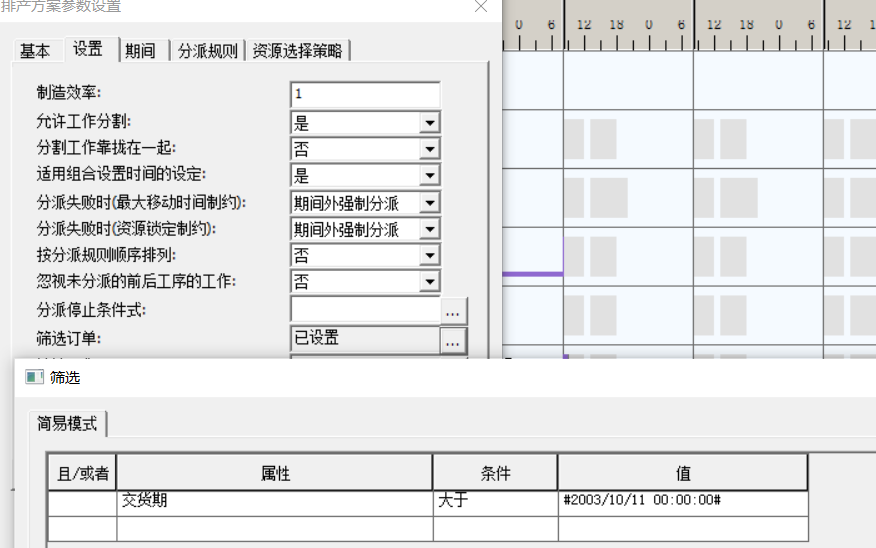

1.  在排产方案参数期间标签，设置分派开始时间为\#2003/10/11\#。

    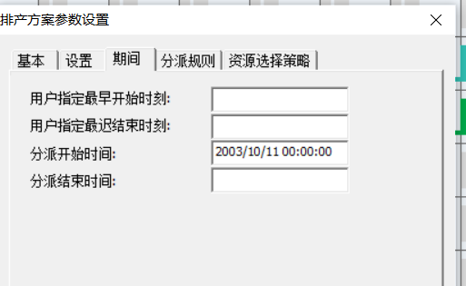

2.4重新排程，于是 20 日的订单在 11 日以后分派。

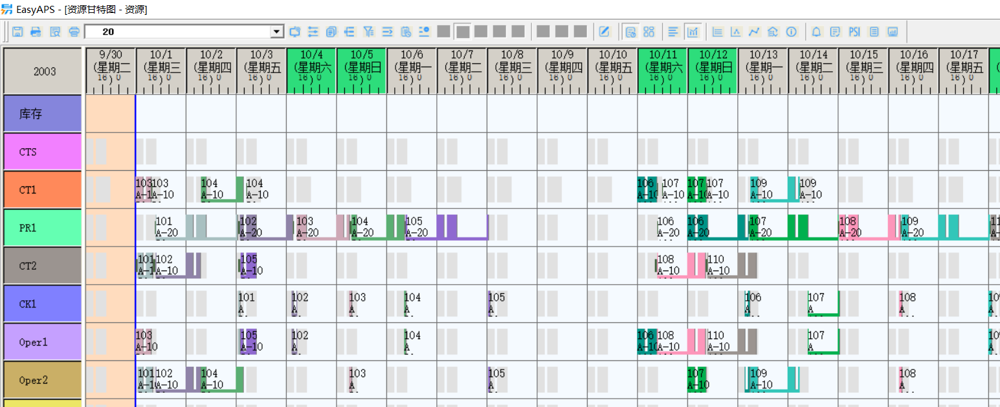

这样，先排方案 10 之后排产方案20，且各方案只依次分派了自己筛选的数据。

1.  直接执行排产方案ABC，利用命令的构造可以让２个方案连续运行。

3.1. 重新排程，于是排产方案ABC下面的方案 10 和 20 连续运行。大家可以看到分派结果是一样的。

### 2c4 正方向/逆方向排程

到目前为止，生产计划以正方向排程，从左到右分派工作。相反，从交货期开始向左分派工作叫做逆方向排程。

通过排产方案的分派方向属性的设定，可以不受订单分派方向影响而一律正向分派或者逆向分派。在这里进行逆方向分派。

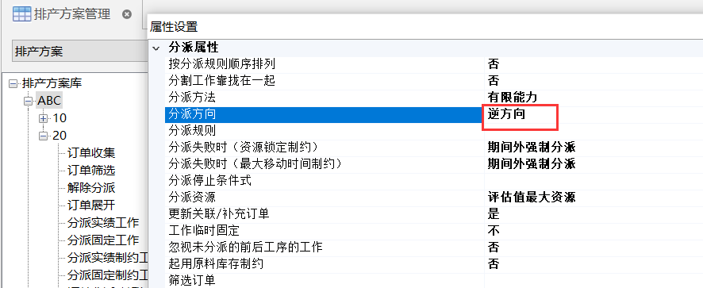

重新排程，于是各订单以交货期为基点逆方向分派。

### 2c5瓶颈中心排程

从现在的分派结果我们可以明显地看到，第二道工序的资源 PR1 是全体计划的瓶颈。不管单纯的正向排程还是逆向排程，从结果来看都因工序之间的等待时间过长而中间库存增大。

像这样的单纯范例中，如果固定瓶颈工序之后再进行排成便可以解除等待时间过长的现象。

1\. 实习使用手动调整。

1.1. 用鼠标选择分派在资源PR1上的工作。

1.2. 点击工具栏的固定按钮。

如此，固定工作然后重新排程。前后工作靠拢固定的工作而分派，因此一次排程之后固定瓶颈资源再排程即可。

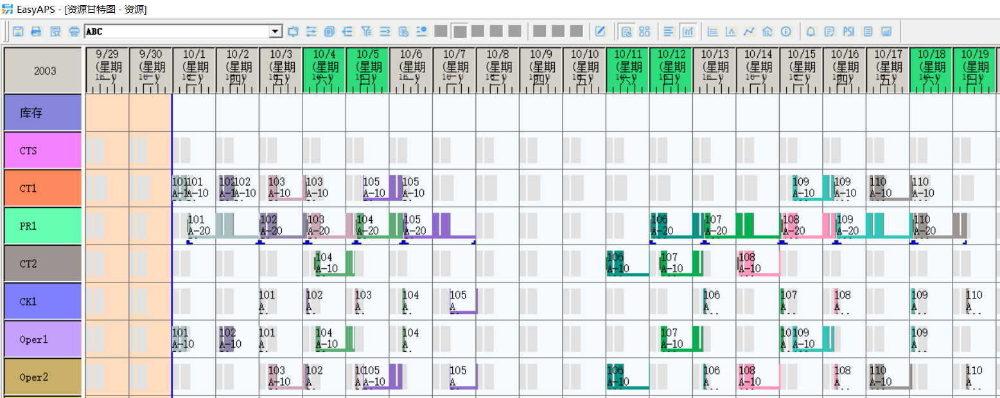

2\. 接下来，我们用两种方法来尝试自动调整。

再次用鼠标选择刚才固定的工作，单击右键选择工作非固定。首先，制作跟上面手动操作完全相同效果的排产方案参数。我们可以使用排产方案参数的工作临时固定属性来实现它。

1.  排产方案参数设置。
    1.  设定工作临时固定属性为瓶颈资源。

        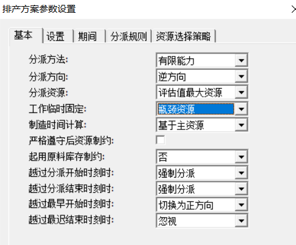

        为了使现在制作的排产方案的工作临时固定属性的瓶颈资源有效，设定资源PR1的瓶颈资源属性。

    2.  选择资源PR1，设定瓶颈资源属性为瓶颈资源。

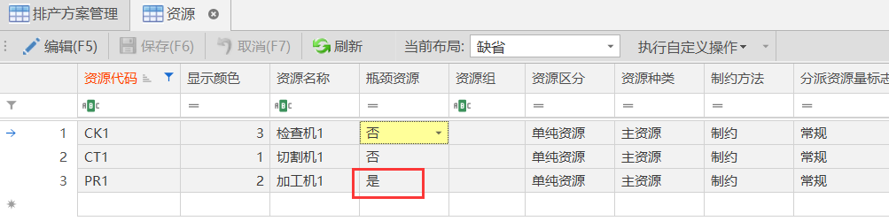

2.4. 为了返回前面的状态选择标准排产方案（订单级）后进行重新排程。

2.5. 然后再用[瓶颈]参数方案重新排程，现在自动地实现了刚才用手动固定资源 PR1 的工作后排程的操作。

3\. 另外一种方法是，不使用工作临时固定，而是把分派在 PR1 前工序的资源 CT1 和 CT2 上的工作逆向分派。

3.1将计划返回前面的状态。选择 排产方案ABC后重新排程。

3.2新方案的制作。

设定新建方案名称为[CT]，将如图的内部命令按照顺序追加到[CT]的下

面。

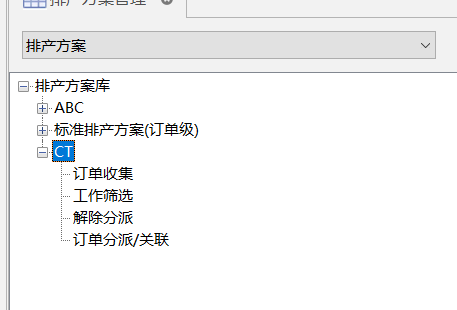

3.3 设置工作筛选条件。筛选主资源为CT1和CT2的工作。

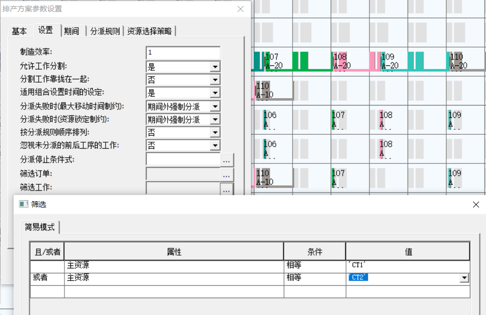

3.4设置CT工作的分派方向为逆方向。分派资源设定为当前资源。

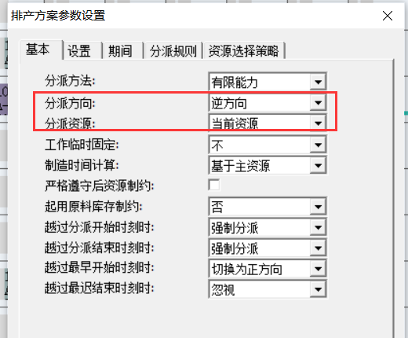

1.  使用方案[CT]排程，我们可以看到只有第一道工序的工作从瓶颈工序开始逆向分派。针对排产方案ABC的分派结果进行比较。和固定瓶颈资源工作的方法不同的是，只对第一道工序的资源 CT1、CT2 上的工作进行了再分派，对其它的工序没有影响。

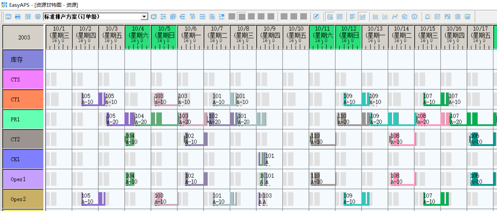
