## 2f 数据原型的制作——热处理的追加

导入排产易以后，ABC 公司进行了市场调查。调查结果表明产品「AX」的大部分客户选择产品的基准从以前的「低价格」转移到了「安全性」。根据这样的信息，为了确保更大的市场占有率，因此决定提供对强度较弱的品目「A」进行热处理来提高强度的选项。

为了支持热处理选项，将工序进行以下变更。

以前的工序 切割 (CT) + 加工 (PR) + 检查 (CK)

新工序 切割 (CT) + 加工 (PR) + 热处理 (HT) + 检查 (CK)

作为热处理方法，预定提供以下的选项。

没有热处理 （以前的生产过程）

低温度处理

中温度处理

高温度处理

公司内部进行热处理的资源有一台。但是，由于是平时稼动率较高的资源，仅用一台很可能会出现供不应求的现象。因此，最后决定在初期阶段以下面的条件实行外协分派。

HT1 公司内部的炉 数量为小于 100 的订单

HTG 外协 数量为大于 100 的订单

公司内部的炉具有以下特征：

1\. 炉是批处理型的，处理时间与数量无关而固定为 6 个小时。

2\. 如果温度要求相同，就可以同时处理 3 个工作。

3\. 处理过程中炉门不能打开，这样同时进行处理的工作必须同时放入同时取出。

4\. 改变温度的设定时，根据以下温度的前后关系将发生设置工作。

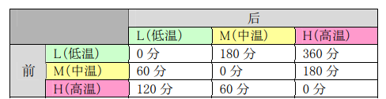

转换温度设置表

5\. 设置与制造中需要安排作业员（资源代码＝HTS）。

6\. 炉作业员的工作时间为 8:00-21:00。

7\. 不属于本系统计划范围的物料也用这个炉，因此，物料[A]的处理只在每周的星期一和星期二进行，而其它时间原则上进行其它产品的处理。

8\. 一旦放进了炉资源就不能中断。

热处理的外协工厂具有以下特征：

1\. 从公司内部工厂向外协工厂移动需要一定的时间，公司内部的加工结束后，外协工厂通常在第二天的早晨就可以开始工作。

2\. 外协的详细生产计划委托给外协工厂，因此在排产易中进行无限能力排程，将提前期设定为两天的固定值。

-   排产易设置概要

接下来，为了追加热处理工序进行模板数据的变更。从使用之前物料A的数据进行变更。确认变更设定后，再根据练习进行剩下的设定。最后，使用相同的数据进行几个其它功能的练习。

| 需要变更的部分 | 工序选定器（两种生产工艺的输入） 工序 HT 的追加 资源 HT1 的能力设定 资源 HT1 的生产日历设定 测试用的订单输入                                                                                                                                                                    |
|----------------|---------------------------------------------------------------------------------------------------------------------------------------------------------------------------------------------------------------------------------------------------------------------------------|
| 需要设定的部分 | 订单的规格（处理温度）设定 工序选定器有效条件 规格的显示颜色 由于规格切换产生的前后依赖的设置时间 炉资源作业员 HTS 的追加 炉资源 资源量设定 外协资源 HTG 的追加 任务选定器（资源组合的设定）  任务选定器有效条件 外协资源 HTG 的移动时间设定 无限能力的设定 中断时间 MAX 的设定 |
| 其它功能的设定 | 炉有效条件表达式 根据规格的分派条件 由于品目转换产生的前后依赖的设置时间 由于副资源转换产生的前后依赖的设置时间 使用指令有效条件                                                                                                                                                |

-   更改现有数据
1.  工艺产能

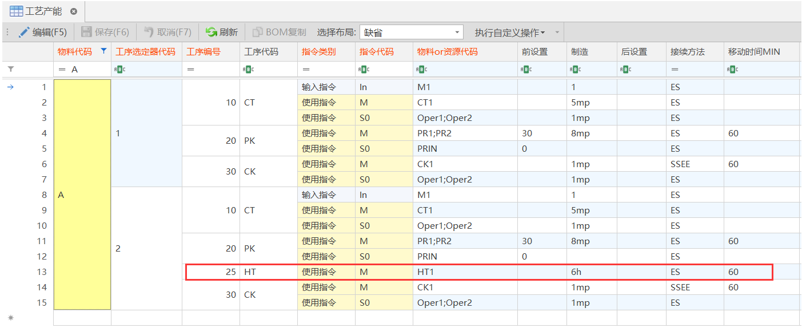

工序选定器的列中输入有1和2这样的值，其设定表示有两种生产工艺。工序选定器 1 为以前的生产工艺，工序选定器 2 为包括热处理工序的生产工艺。这个设定表示同样的物料A有追加热处理的生产方法和没有热处理的生产方法。工序 HT 中设定有资源 HT1，制造能力值设定 6h 固定时间。

1.  生产日历

    日历设置表和班次如下所示：

    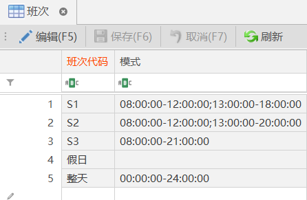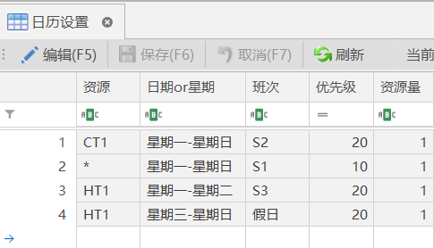

从上面可以确认到资源 HT1 在星期一和星期二的 8:00-21:00 可以使用，在其它的时间不可使用。

1.  制造订单

    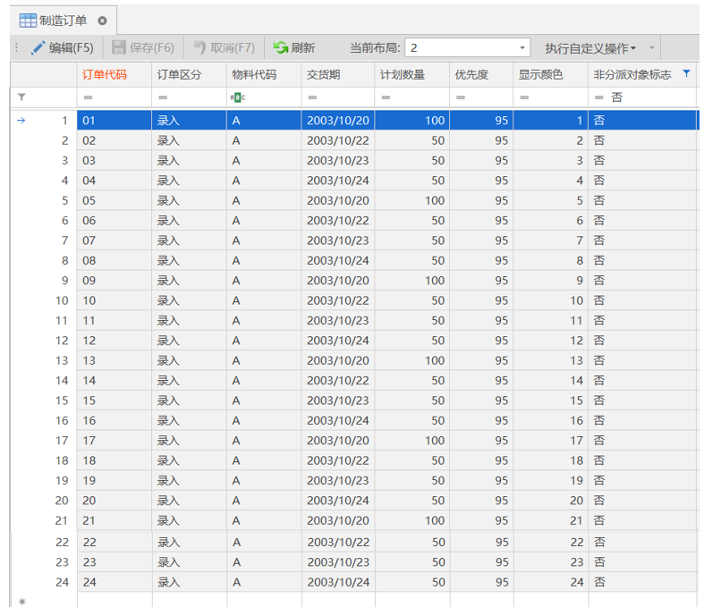

物料A 的订单输入了 24 个，数量 100 的订单和 50 的订单混杂在一起。

4．重新排程

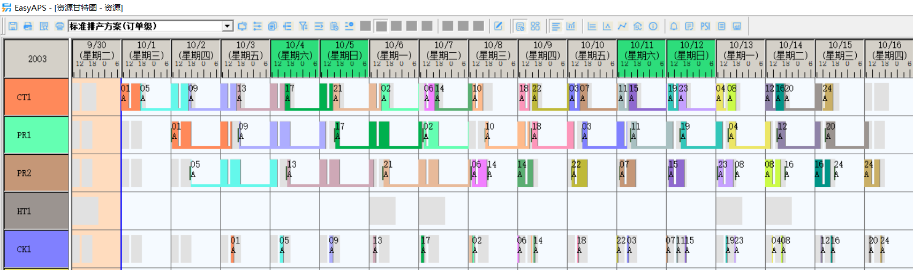

图中分派有 24 个订单，两个生产工艺当中只使用了其中的一个(没有热处理的方法)。下面，实习剩余的设定，使计划能像这一节背景中说明过的生产计划那样进行。

### 2f1 订单规格（处理温度）的设定

设定订单的规格（处理温度）。

排产易中，将[温度][颜色][长度][宽度]等任意一个属性通过变更生产特征1\~10的名称来设定。ABC公司中，因为根据[处理温度]不同，设置时间与生产工艺将随之发生变化，所以变更[生产特征1]属性名称为[温度]来进行处理温度的设定。

1\. 规格可以在订单、物料表中设定。

1.1. 在订单中设定的时候，就作为该订单的特征使用。

1.2. 在物料中设定的时候，就适用于没有设定或者相同特征的订单。

2\. ABC热处理方法与订单数量有关，因此在订单表设定生产特征。

2.1打开制造订单表，变更生产特征1的名称。打开表格设置，在生产特征1输入自定义显示[温度]。

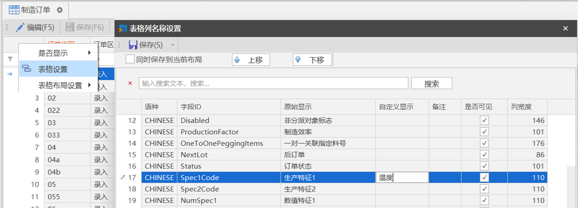

2.2在订单表的温度列。输入[无热处理]、[高]、[中]、[低]。

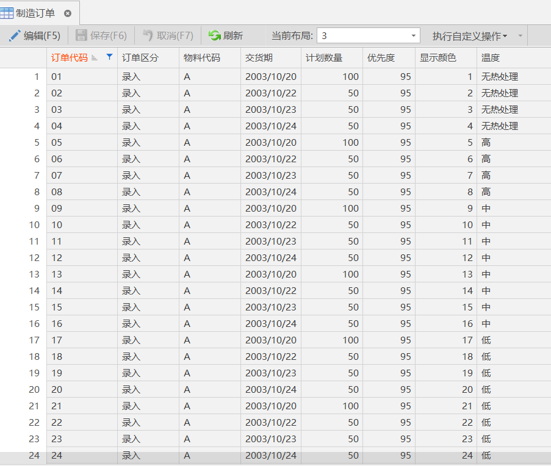

### 2f2 工序选定器有效条件的设定

设定工序选定器有效条件。

订单的温度属性为[高][中][低]表示需要通过热处理，而温度属性为[无热处理]表示不通过热处理工序的生产工艺。这种条件设定在工艺产能的[工序选定器表达式]。

1.  输入工序选定器1和工序选定器2的条件表达式。

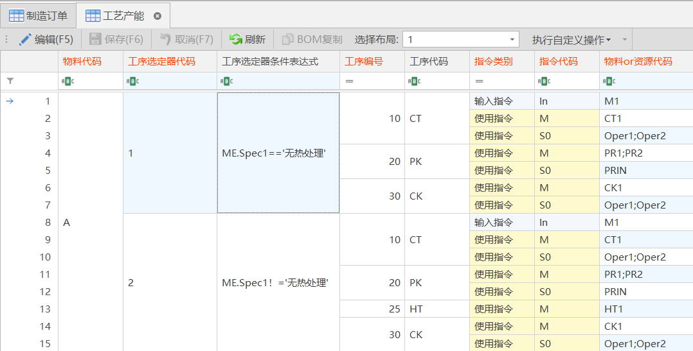

1.  重新排程看一下。

    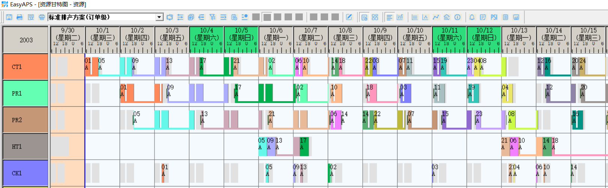

    观察甘特图，可以看到一部分订单经过热处理，一部分不经过。

### 2f3 用规格表示显示颜色的设定

甘特图上的图棒显示订单的颜色，试一下使用生产特征的颜色来显示。

1.  在生产特征1输入显示颜色。

    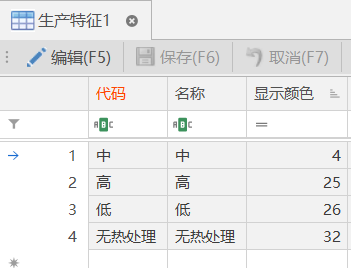

2.  在甘特图显示设置将棒显示颜色设定为[生产特征1].

    

    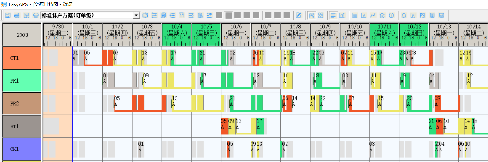

    这样，甘特图的图棒就用订单生产特征１的颜色显示了。温度属性为[无热处理]的订单（灰色的订单）不经过热处理，其它订单经过热处理工序，一目了然。

### 2f4 由于特征切换而发生的切换时间的设定

设定由于特征转换产生的前后依赖的设置时间。

输入项目

资源 （输入对象资源代码。例：HT1）

前特征 （输入生产特征１代码。例：低）

后特征 （输入生产特征１代码。例：中）

设置时间 （用分单位设定。例：180）

优先级 （越想优先，设定值也越高。例：100）

1.  打开生产特征1切换，输入切换信息，根据情节背景中介绍的温度转换设置表进行设定。优先级可以 输入任意值，这里输入[100]。

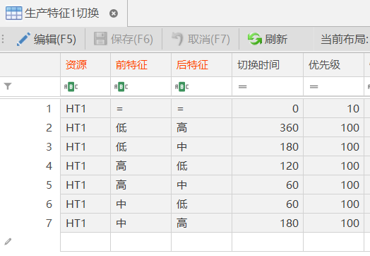

第一行数据代表前特征等于后特征时，切换时间为0.

1.  重新排程

    热处理工作之间发生了设置工作，可以看到设置时间长度也符合温度转换表。

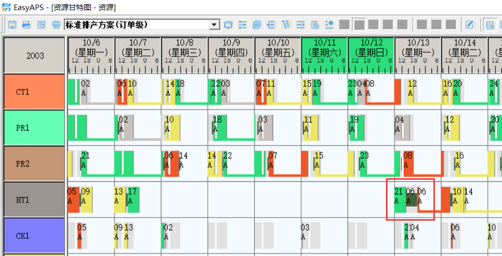

### 2f5 追加炉资源的作业员

追加炉资源的作业员 HTS。

1.  打开工艺产能，新增工序HT的使用指令，前设置时间和制造时间输入为[0]，于是前设置和制造就都配备该作业员。

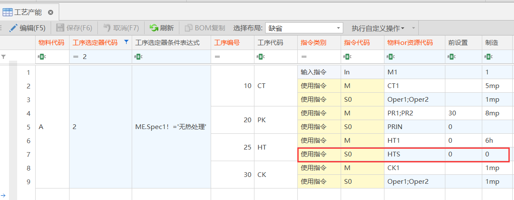

2.打开日历设置表，设定资源 HT1 的生产日历也适用于资源 HTS。

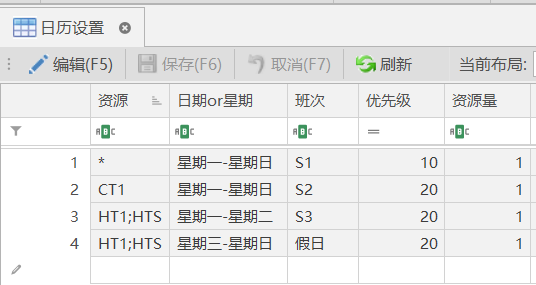

3\. 重新排程，于是可以看到：作业员[HTS]和热处理工序的资源[HT1]同时被分派了工作。

### 2f6 设定资源量

在资源HT1上设定[只要温度相同，就最多可同时处理3个工作]的制约。同时，设定作业员HTS[可以进行最多 3 台的多台管 理]的制约。

1.变更日历设置表，设定资源为3个。

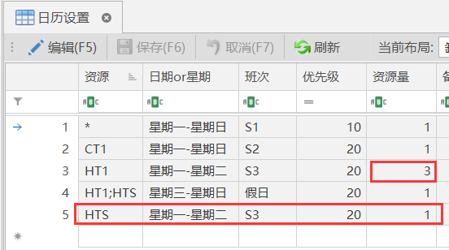

2.在工艺产能里，资源HTS的使用指令的必要资源量设定为[0.33](1 除以 3 的数)，设定 1 个人可以最多管理 3台机器。

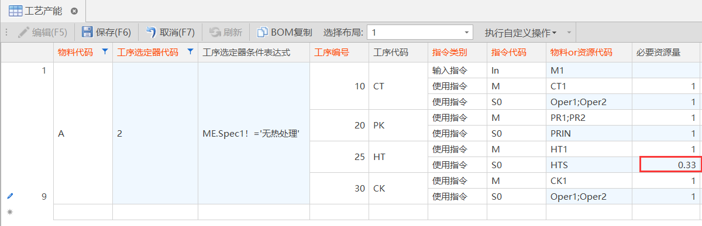

3.重新排程。

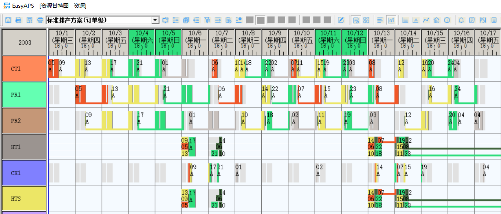

可以看到：资源HT1变为能够同时处理３个工作。在HT1的行里有白线表示有３个资源，而HTS里没有白线，可知 1 个人管理多台机器进行生产。

### 2f7 设定炉资源

设定[只有温度要求相同的工作才可以同时进行热处理]。

1.  设定HT1为炉资源。

    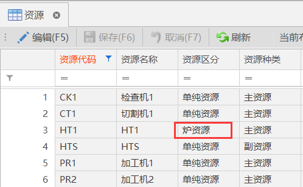

2.设定HT1的炉有效条件式。只有温度相同的工作才能同时进行。

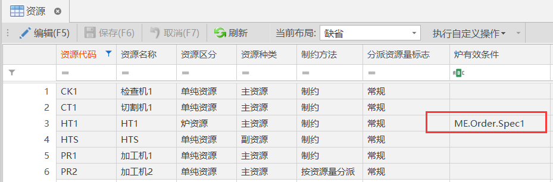

3.重新排程。

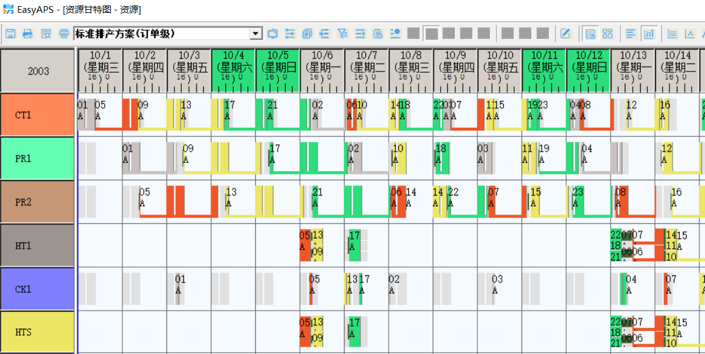

从图棒的颜色可以看到：只有工作的处理温度一样的情况下才可以同时处理，而且进行热处理的工作必须同时投入同时取出。

### 2f8 设定外协资源

HT1的设定到此为止，接下来追加外协资源 HTG。设定外协资源时，一般来说可以像设定公司内部资源一样进行设定。

1.  打开工艺产能，在工序HT里追加使用指令，如下设定：

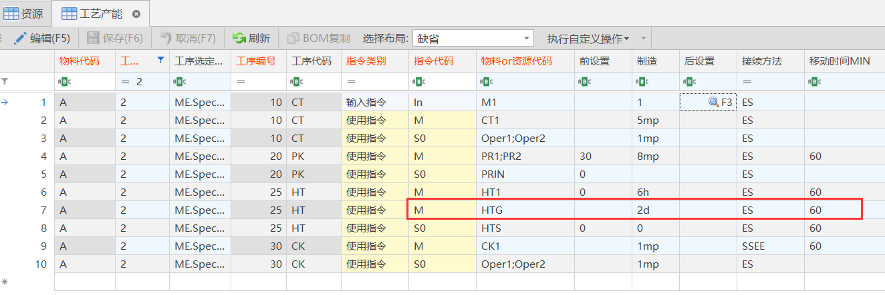

2.设定资源HTG的显示颜色和显示顺序。

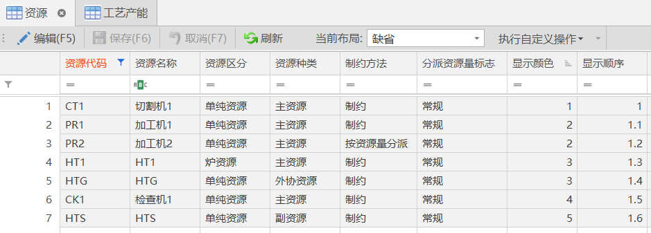

3.设定资源HTG的生产日历。

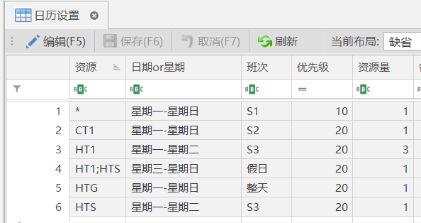

4.重新排产。

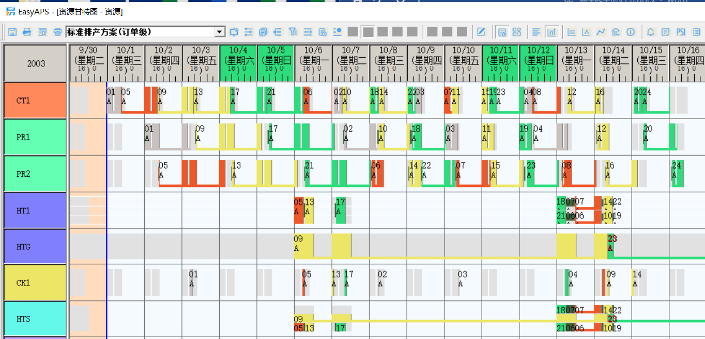

追加外协资源 HTG 之后的排程结果

### 2f9 设定任务主资源（资源的组合）

现在，已经可以在外协资源上分派工作，但结果显示作业员 HTS 也管理外协的工作，违反了作业员仅做公司内部工作的规定。设定资源的组合的时候，使用任务选定器。

1.  打开工艺产能，将工序HT的HT1和HTS使用指令的任务选定器设定为[1]，HTG的使用指令的任务选定器设定为[2]。这种设定的意思是，[在工序HT里有两种生产方法，一种是HT1和HTS成对使用，另一种是单独使用 HTG]。

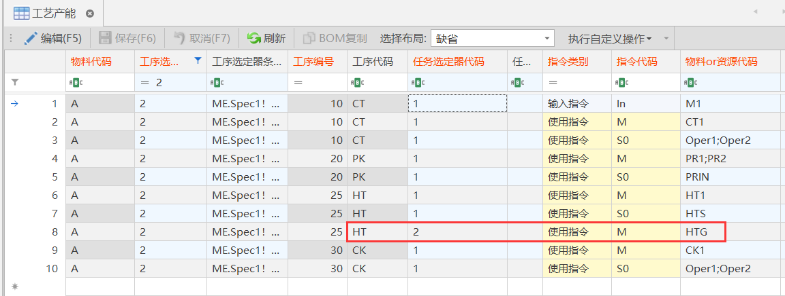

1.  重新排程。

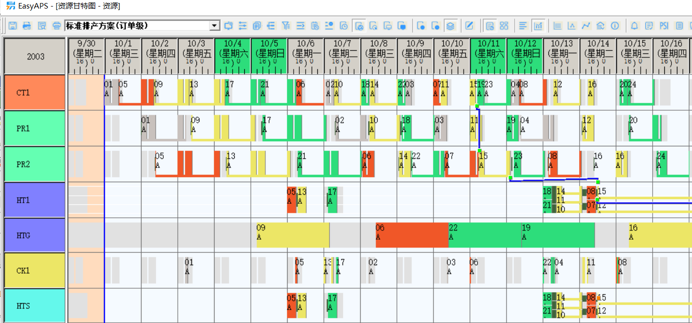

可以确认 HTS 只在 HT1 时使用。

### 2f10任务选定器有效条件的设定

下面，进行数量为50个的订单在公司内生产，100个的订单由外协工厂生产的设定。

1\. 打开工艺产能，选择工序HT的任务选定器 1。在任务选定器条件表达式输入：ME.Order.Qty \< 100。

2\. 同样地，在任务选定器2的条件表达式里录入以下表达式。

ME.Order.Qty \>= 100

3.重新排程。

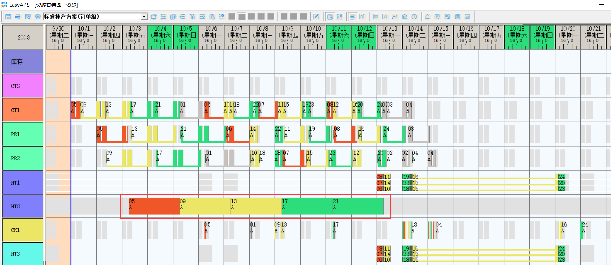

设定任务选定器有效条件之后的排程结果

可以看到：只有数量为100（以上）的订单分派到HTG上。

### 2f11 外协资源的移动时间的设定

设定外协资源 HTG 的移动时间。现在的模板数据设定中，向资源 HTG 的移动时间（移动时间 MIN）和 HT1 同样 60 分钟，修改为[从第二天的上午 0 点开始工作]。

1\. 打开工艺产能，将资源 HTG 的使用指令的移动时间变更为[H1D]

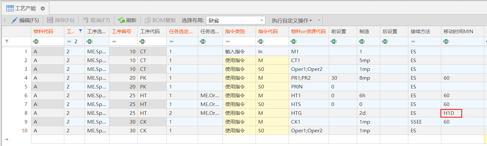

2.重新排程。

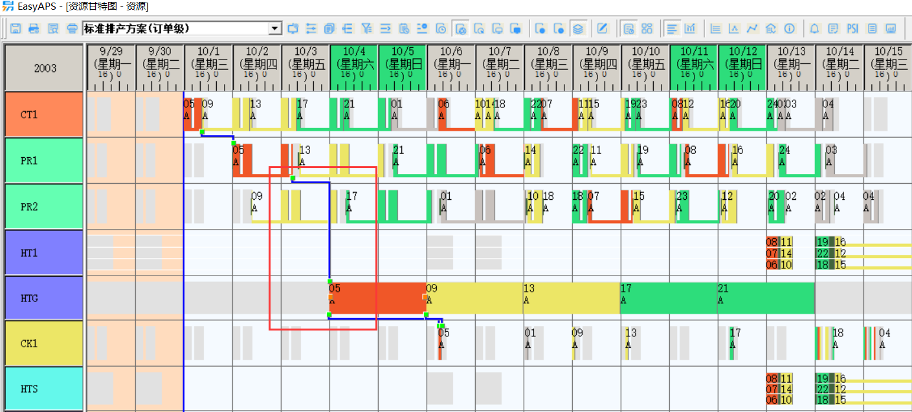

可以看到：HTG 上分派的工作是前工序结束后的第二天上午 0 点开始的。

### 2f12 设定无限能力

设定无限能力。 最后，像情节背景中记述的那样，设定外协资源 HTG 的无限能力。 在资源表上，将HTG的制约方法设定为[不制约]。

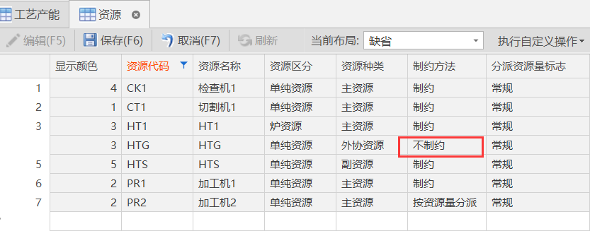

重新排程。

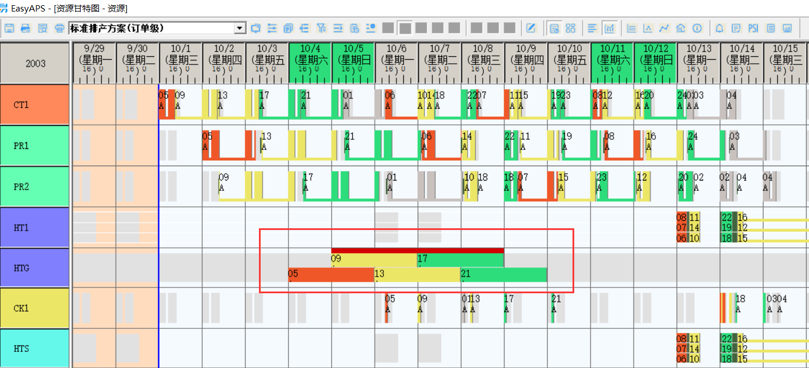

外协资源 HTG 设定为无限能力之后的排程结果

可以看到：在资源 HTG 上工作以无限能力自由地堆积。

### 2f13 制造中断时间 MAX、设置中断时间 MAX 的设定

设定炉资源从开始生产到结束不能制造中断。选择资源 HT1，设定制造中断 MAX 以及前设置中断 MAX（-1代表不能中断）。

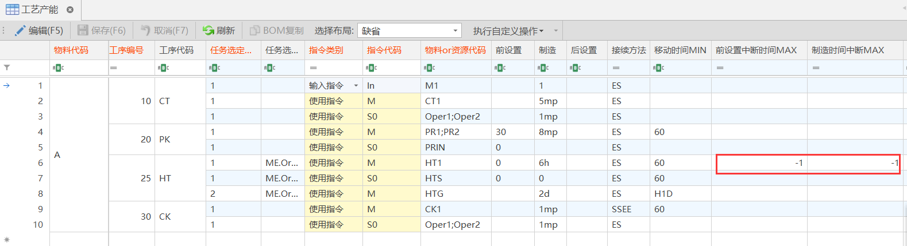

重新排程。

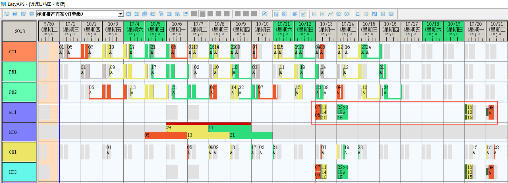

可以看到：资源 HT1 没有发生中断现象。 这样，完成了热处理工序的追加。
